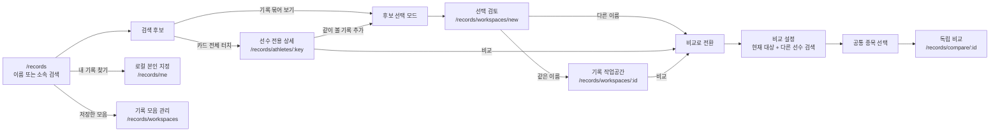

# AthleteTime 선수 기록 작업공간 UX 개편 계획

## TL;DR

> **핵심 해결**: 일반 탐색 중인 다른 선수 기록이 `내 기록` 저장소로 들어가는 현재 구조를 없앤다. 공개 프로필 하나는 독립 상세 페이지로 바로 열고, 같은 이름의 여러 공개 프로필을 함께 볼 때만 검토 단계를 거쳐 전용 작업공간을 만든다.
>
> **사용자가 느끼는 변화**:
> - 검색 결과 카드를 누르면 그 선수 기록만 있는 새 페이지가 즉시 열린다.
> - 여러 공개 프로필을 골랐다면 별도 검토 페이지 뒤에 선택한 소속·확인 시즌·기록·출처가 정리된 작업공간이 열린다. 같은 사람으로 확인됐다는 뜻은 아니다.
> - 기록 행은 짧게 보이고, 누르면 상세가 아래에서 열린다.
> - `모음에서 빼기`, `되돌리기`, `비교`, `기록이 틀렸어요`가 서로 다른 의미로 작동한다.
> - “전체 기록”이라고 과장하지 않고 확인된 수, 아직 불러오지 않은 수, 확인 연도와 출처를 보여준다.
>
> **보존하는 것**: 현재 검색 색인, 보수적 선수 식별, 출처, 억제·정정 정책, 시즌 기록표, 기존 디자인 토큰.
>
> **교체하는 것**: `내 기록`과 일반 탐색이 공유하는 저장소, `/records` 한 페이지에 몰린 상태, 긴 모바일 카드, 고정 하단 바 중첩.

**Effort**: XL
**Parallel**: YES, 5개 거시 파동(파동 3은 A/B 순차)
**Critical Path**: 1 → 1A → (2·3·4) → (5·6) → (7·8·9·10) → 11 → 12 → 13

---

## 1. 배경과 현재 진단

### 사용자 문제

- 본인 기록을 지정해 둔 상태에서 다른 선수를 검색하면 두 문맥이 한 화면에 섞인다.
- 여러 소속 후보를 “모아 보기” 해도 무엇을 왜 모았는지, 빠진 기록이 있는지 알기 어렵다.
- 기록이 최신순 한 줄 목록으로 길게 이어져 종목·시즌·소속 구분이 약하다.
- 모바일에서 검색 카드, 내 기록 바, 비교 바, 탭바가 겹쳐 피로도가 높다.
- 중학생 사용자는 긴 설명과 긴 스크롤보다 한 단계씩 화면이 바뀌는 흐름이 필요하다.

### 코드 근거

- `frontend/src/components/record-insights/useMyAthlete.ts:13`:
  `athletetime.my-athlete.v2` 하나가 본인 지정과 일반 기록 모음에 함께 쓰인다.
- `frontend/src/pages/RecordsPage.tsx:65`:
  `useMyAthlete`와 `useCompareTray`가 검색·상세·비교 전체를 소유한다.
- `frontend/src/pages/RecordsPage.tsx:560`:
  일반 기록 화면에도 저장된 “내 기록” 카드가 삽입된다.
- `frontend/src/pages/RecordsPage.tsx:619`:
  일반 검색 결과의 `onToggleMine`이 같은 본인 저장소를 변경한다.
- `frontend/src/pages/RecordsPage.tsx:44`:
  한 컴포넌트가 허브, 검색, 본인 찾기, 상세, 시즌표, 모음, 비교를 모두 제어한다.
- `card-studio/services/recordAnalyticsService.js:90`:
  선수 프로필은 최대 80개 기록만 반환하지만 화면에는 절단 상태가 표시되지 않는다.
- `frontend/src/components/ScrollToTop.tsx:8`:
  경로명만 감시하므로 현재 쿼리 기반 단계 전환과 검색 복귀를 제대로 다루지 못한다.
- `frontend/src/components/record-insights/CompareTray.tsx`와
  `frontend/src/components/records/RecordSearchResults.tsx`:
  모바일 고정 하단 영역이 중첩될 수 있다.

### 기존 정책과의 정합

- `docs/athletetime-identity-roi-decision.md`:
  동명이인을 자동 병합하지 않고 분리 표시한다.
- `docs/athletetime-self-claim-record-grouping.md`:
  본인 기록 묶기는 명시적 선택과 되돌리기를 전제로 한다.
- `docs/athletetime-record-exploration-design.md`:
  비교는 동일 종목·호환 단위에서만 하며 우열 평가 문구를 피한다.
- `docs/design-system-trainoracle/PHILOSOPHY.md:47`:
  360px 모바일 우선.
- `docs/design-system-trainoracle/PHILOSOPHY.md:66`:
  핵심 터치 목표 44x44px 이상.
- `docs/design-system-trainoracle/PHILOSOPHY.md:218`:
  장식용 애니메이션 금지.

---

## 2. 결정된 제품 모델

### 2.1 네 문맥을 분리한다

| 문맥 | 뜻 | 저장 | 주소 | 금지 |
|---|---|---|---|---|
| `selfClaimDraft` | 이 기기에서 본인 기록으로 지정한 비권위적 초안 | 별도 localStorage | `/records/me` | 일반 탐색이 쓰기 금지 |
| `browseTarget` | 지금 열어 본 공개 선수 프로필 하나 | URL·쿼리 캐시 | `/records/athletes/:athleteKey` | `내 기록` 표현 금지 |
| `recordWorkspace` | 같은 이름의 여러 공개 프로필을 동일인 확정 없이 함께 보는 뷰 | 별도 localStorage | `/records/workspaces/:workspaceId` | 원본·신원 병합 금지 |
| `comparison` | 서로 다른 선수도 포함 가능한 독립 비교 세션 | 별도 sessionStorage | `/records/compare/:compareId` | 작업공간을 한 사람으로 단정 금지 |

### 2.2 `athleteKey`의 의미

- 작업공간은 현재 공개 분석 API가 반환하는 `athleteKey`만 저장한다.
- 현재 기본 `athleteKey`와 기록 ID는 공개 사실을 SHA-1로 만든 안정 가명 키다.
  익명 정보, 비밀값, 본인 확인 수단, 역추적 불가능한 값으로 취급하지 않는다.
- 내부 원시 식별 조각, `person_no`, 생년월일, 새 동일인 ID를 만들거나 저장하지 않는다.
- 한 작업공간에 여러 키가 있어도 서버 데이터는 병합하지 않는다.
- 서로 다른 정규화 이름은 “한 선수 기록 모음”으로 확정할 수 없다.
- 서로 다른 이름을 고르면 `비교로 보기`로 전환한다.
- 작업공간은 새 canonical 매핑을 만들지 않으며, 한 키가 한 사람임을 보증하지 않는다.
- 현재 빈 `data/identity/athlete-map.json`을 활성화하기 전에는
  0.85~1 범위의 유한한 `matchConfidence`, `decisionBasis: "manual_verified"`,
  비어 있지 않은 `sourceRefs`, 검토된 `matchedAthleteKeys`를 요구하고
  `matchKeys` 단독 병합과 키·canonicalId 충돌을 금지한다.

### 2.3 소속 표현

- `현 소속` 금지.
- 단일 공개 프로필 또는 사용자가 명시적으로 본인 기록으로 지정한 문맥에서만
  가장 늦은 공개 기록의 소속을 `최근 확인 소속`으로 표시한다.
- 위 문맥의 더 이른 소속만 `이전 확인 소속`으로 표시한다.
- 여러 `athleteKey`를 고른 일반 작업공간에서는 선수 경력의 연속성을 전제하지 않는다.
  `선택한 기록의 소속`, `다른 기록에서 확인된 소속`으로 표시한다.
- 다중 키 작업공간의 이름 아래에는 항상
  `같은 이름의 기록을 함께 보고 있습니다. 같은 사람으로 확인된 것은 아닙니다.`를 표시한다.
- 단일·본인 문맥에서도 같은 마지막 날짜 또는 시즌에 둘 이상의 소속이 있으면
  `최근 소속 확인 필요`로 표시한다.
- 소속별 최초·최종 확인 시즌과 기록 수를 함께 제공한다.

### 2.4 완전성 표현

- `전체 기록`, `완전한 이력` 금지.
- 단일 프로필은 `AthleteTime에서 확인된 N개`를 사용한다.
- 다중 키 작업공간은 `선택한 공개 기록 N묶음에서 확인된 N개`를 사용한다.
- API가 반환한 `totalMatched`와 현재 `returned`를 분리한다.
- 예: `확인된 124개 중 50개를 먼저 보여드려요`.
- 연속 범위가 아니라 실제 관찰 시즌을 사용한다.
- 중간 빈 해는 `기록이 확인되지 않은 해`로 표시하고
  `미출전인지 자료 누락인지 구분할 수 없어요`를 함께 표시한다.
- `totalMatched`는 선택한 공개 그룹 키에서 현재 공개 가능한 기록 수이며,
  한 사람의 전체 경기 이력이나 공식 실적 수가 아니다.
- 억제·검토중인 기록의 존재나 수는 공개 응답에서 드러내지 않는다.

### 2.5 편집 의미

| 사용자 행동 | 결과 |
|---|---|
| `이 모음에서 빼기` | 현재 기기의 작업공간에서만 숨김 |
| `되돌리기` | 다음 파괴적 동작 또는 페이지 이탈 전까지 직전 로컬 제외 복구 |
| `다시 모두 보기` | 해당 작업공간의 로컬 제외 목록 초기화 |
| `기록이 틀렸어요` | 기존 정정·숨김 요청 화면으로 이동 |
| `비교` | 기록 편집과 분리된 설정 단계에서 2~4개 프로필과 한 종목을 선택 |

- 기록 숨김 선택 모드와 비교 대상 선택 모드는 하나의 체크 상태를 공유하지 않는다.
- 숨김 뒤에는 `최근 변경: N개 숨김 · 되돌리기`를 계속 표시하고 `aria-live="polite"`로 알린다.
- 되돌린 뒤에는 복구된 기록 근처로 초점을 돌리되 현재 스크롤을 갑자기 재정렬하지 않는다.

---

## 3. 사용자 여정 청사진



### 3.1 다른 선수 한 명

1. `/records`에서 검색한다.
2. 결과 카드 전체를 누른다.
3. `/records/athletes/:athleteKey`가 새 화면으로 열린다.
4. 상단에는 이름, 최근 확인 소속, 확인 시즌, 확인 기록 수만 먼저 보인다.
5. 기본 `기록` 탭에는 종목명과 기록 수만 있는 짧은 종목 인덱스가 열린다.
6. 종목을 누르면 그 종목의 시즌 목록과 최신 기록 10개만 열린다.
7. 기록 행을 누르면 하단 상세 시트가 열리고 브라우저 뒤로 가기는 시트를 먼저 닫는다.
8. 상세 페이지에서 뒤로 가면 검색어, 결과, 스크롤과 눌렀던 카드 초점으로 돌아온다.

### 3.2 같은 이름의 여러 공개 프로필

1. `기록 묶어 보기`를 눌러 선택 모드에 들어간다.
2. 같은 이름의 공개 프로필을 최대 6개 고른다.
3. `/records/workspaces/new`에서 이름, 소속, 확인 시즌을 카드별로 검토한다.
4. 서로 다른 이름은 확정을 막고 `비교로 보기`를 제공한다.
5. 확정하면 `crypto.randomUUID()`로 로컬 작업공간 ID를 만든다.
6. 작업공간은 원본을 합치지 않고 한 화면에 함께 보여준다.
7. 이름 아래의 동일인 미확인 문구와 각 기록의 원래 소속 경계를 계속 유지한다.

### 3.3 내 기록

1. `/records/me`에서만 `내 기록` 문맥을 사용한다.
2. `나로 지정`은 본인 찾기 흐름 안에서만 노출한다.
3. 문구는 `이 기기에서 내 기록으로 지정`으로 제한한다.
4. 로그인 여부와 관계없이 계정 인증이나 영구 소유권으로 표현하지 않는다.
5. 계정 기반 본인 인증·동기화는 별도 후속 계약 없이는 구현하지 않는다.

### 3.4 비교

1. 선수 상세 또는 작업공간의 `비교`를 누르면 현재 프로필 조각을 첫 대상으로
   사전 선택한 로컬 비교 세션을 만든다.
2. 같은 화면의 검색 입력에서 다른 선수를 찾아 최대 4명까지 추가한다.
3. 한 명뿐일 때는 `비교할 선수를 한 명 더 추가해 주세요`와 함께
   `비교 보기`를 비활성화한다.
4. 두 명 이상이면 공통으로 비교 가능한 종목만 활성화한다.
5. 종목 하나를 선택한 뒤 `비교 보기`를 누른다.
6. 기록값, 시즌, 날짜, 풍속·조건, 출처를 선수별 세로 행으로 본다.
7. 설정 중 취소·Back은 세션을 버리고 원래 상세/작업공간의
   주소·스크롤·초점으로 돌아간다.
8. 비교 결과에서 Back은 설정 화면을 복원하며, 다시 Back하면 원래 화면으로 돌아간다.
9. `우수`, `열세`, `전국 순위` 같은 평가 문구를 사용하지 않는다.

---

## 4. 화면 설계

### 4.1 검색 결과

- 카드 전체가 기본 `기록 보기` 동작이다.
- 첫 화면 정보는 이름, 소속, 확인 시즌, 기록 수만 보여준다.
- 동명이인 경고는 한 줄로 유지한다.
- 평상시에는 카드별 `내 기록`, `비교`, `모으기` 버튼을 모두 늘어놓지 않는다.
- `기록 묶어 보기`를 누른 뒤에만 체크 선택과 단일 하단 작업 바가 나타난다.
- 평상시 카드 탭은 상세 주소로 이동하고, 모으기 모드의 카드 탭은 선택만
  전환한다. 같은 탭에 이동과 선택을 동시에 연결하지 않는다.
- 6개가 선택된 상태에서 일곱 번째 카드를 누르면 무시하지 않고
  `한 번에 6개까지 모을 수 있어요`를 카드 근처와 `aria-live="polite"`에
  알린다.
- 일반 검색은 `selfClaimDraft` 저장소를 절대 쓰지 않는다.

### 4.2 선수 상세와 작업공간

상단:

- 뒤로 가기
- 이름
- `선수 기록` 또는 `이 기기에서 내 기록으로 지정` 배지
- `확인된 N개 · 현재 N개 표시`
- 단일 프로필 또는 명시적 본인 문맥에서만 `최근 확인 소속`,
  `이전 확인 소속 N곳`을 사용한다.
- 여러 `athleteKey`를 함께 볼 때는 `선택한 기록의 소속 N곳`으로 표시하고
  다음 경고를 상단에 계속 둔다.
  `같은 이름의 기록을 함께 보고 있습니다. 같은 사람으로 확인된 것은 아닙니다.`
- 위 경고와 완전성 문구는 13px 이상, 배경 대비 4.5:1 이상이며 색만으로
  상태를 전달하지 않는다.

본문:

- 기본 탭 `기록`
- 보조 탭 `소속`, `출처`
- 첫 화면은 기록 행 전체가 아니라 `종목 · 확인된 기록 수`의 간결한 색인이다.
- 종목을 누르면 해당 종목 화면으로 들어가 `시즌 > 날짜` 순으로 본다.
- 가장 최근 시즌 하나만 펼치고 최초 10개 행만 보여준 뒤
  `10개 더 보기`로 화면 표시량을 늘린다.
- API 50개 페이지는 내부 수집 단위일 뿐, 한 번에 보여주는 행 수로 사용하지 않는다.
- 빠른 제어는 `연도` 필터와 `최신순` 정렬을 분리한다.
- 연도가 많으면 `2019 · 2021–2024`처럼 요약하고 `연도 모두 보기`에서 펼친다.
- 기록 행에는 종목, 기록값, 날짜, 대회만 노출
- 상세 시트에는 부문, 단계, 풍속, 장소, 소속, 출처, 정정 링크 노출
- 섹션마다 큰 카드를 겹겹이 쌓지 않고 hairline, 글자 크기, 여백으로 위계를 만든다.

편집:

- `기록 고르기`를 눌러 선택 모드 진입
- 하단 작업 바는 `N개 선택`, `이 모음에서 숨기기`, `취소`만 제공한다.
- 비교는 편집 모드와 별개인 상단 `비교` 동작에서 2~4개의 프로필 조각을
  고른 뒤 공통 종목을 선택한다.
- 숨긴 뒤에는 다음 파괴적 동작 또는 페이지 이탈 전까지
  `최근 변경: N개 숨김 · 되돌리기`를 본문에 계속 보인다.
- 되돌리면 복구된 행 근처에 초점을 돌리되 화면을 갑자기 위로 보내지 않는다.
- 모든 터치 목표 44x44px 이상
- 하나의 화면에 고정 하단 작업 바는 하나만 허용

360px 작업공간 기준:

```text
[← 검색 결과]                                  [더보기]
김민준
선택한 공개 기록 3묶음 · 2019, 2021–2024 · 125개 확인
같은 이름의 기록을 함께 보고 있습니다.
같은 사람으로 확인된 것은 아닙니다.        [선택 확인]

[기록] [소속·범위] [출처]

종목
1500m                                      42
5000m                                      31
10000m                                     18
기타 4종목                                 34

선택: 1500m       [연도] [정렬: 최신순]
2024 · 12개                              [접기]
기록 행 10개
[10개 더 보기]
2023                                    [펼치기]
2022 기록 확인 안 됨                    [설명]

평상시: 고정 하단 바 없음
편집 중: [3개 선택] [이 모음에서 숨기기] [취소]
```

### 4.3 상태 문구

| 상태 | 문구 |
|---|---|
| 일부 로드 | `확인된 124개 중 50개를 먼저 보여드려요` |
| 확인 연도 | `2019 · 2021 · 2022 · 2024년에 기록이 확인됐어요` |
| 빈 해 | `2020년은 기록이 확인되지 않았어요` |
| 빈 해 설명 | `미출전인지 자료 누락인지 구분할 수 없어요` |
| 소속 충돌 | `최근 소속을 하나로 확인하기 어려워요` |
| 출처 보류 | `원본을 다시 확인하고 있어요` |
| 저장 이름 없음 | `이 기기에 저장한 기록 모음이에요` |
| 저장 불가 | `지금은 이 탭에서만 볼 수 있어요` |
| 네트워크 실패 | `모아 둔 선택은 그대로예요. 다시 불러와 주세요` |

### 4.4 오류·복구 동작

| 상황 | 유지할 것 | 화면 동작 |
|---|---|---|
| 첫 불러오기 실패 | 주소, 선택 초안 | `다시 불러오기`, `검색으로 돌아가기` |
| 다음 페이지 실패 | 이미 본 기록, 필터, 스크롤 | 목록 끝에 `더 불러오지 못했어요 · 다시 시도` |
| 429 | 이미 본 기록과 모든 로컬 선택 | `잠시 후 다시 불러와 주세요`; 자동 반복 요청 금지 |
| 일부 프로필 이용 불가 | 나머지 프로필과 사용자 지정 모음 제목 | `선택한 기록 하나를 불러오지 못했어요`; `다시 시도`, `이 모음에서 빼기` |
| 모든 프로필 이용 불가 | 사용자 지정 모음 제목 | `기록을 불러오지 못했어요`; `다시 시도`, `검색으로 돌아가기` |
| 브라우저 저장 차단·용량 부족 | 현재 메모리 선택 | `지금은 이 탭에서만 볼 수 있어요`; 계속 보기 허용 |
| 손상된 저장값 | 읽을 수 있는 다른 모음 | 해당 모음만 `복구할 수 없는 모음이에요`; 삭제 또는 검색 재시작 |

- 화면 문구에는 `localStorage`, `UUID`, `cursor`, `volatile` 같은 구현 용어를
  노출하지 않는다.
- 복구 상태와 선택 제한은 아이콘·색에만 의존하지 않고 텍스트와
  `aria-live="polite"`로 전달한다.

### 4.5 저장한 기록 모음 관리

- `/records/workspaces`에서 저장한 모음을 최신 사용 순으로 보여준다.
- API를 불러온 상태의 각 행은 현재 공개 응답의 이름, 선택한 기록의 소속,
  확인 시즌, 마지막으로 본 시각을 보여준다.
- 불러오기 전·실패 상태는 자동 저장한 과거 이름·소속 대신 사용자가 직접 정한
  모음 제목 또는 `기록 모음`을 보여준다.
- 열기, 이름 바꾸기, 삭제를 제공하고 삭제 전 확인한다.
- 20개 한도에 도달하면 오래된 모음을 자동 삭제하지 않고 관리 화면으로 보낸다.
- 삭제한 직후에는 다음 파괴적 동작 또는 페이지 이탈 전까지 되돌릴 수 있다.

---

## 5. 주소·저장·API 계약

### 5.1 주소

- `/records`
- `/records/athletes/:athleteKey`
- `/records/me`
- `/records/workspaces`
- `/records/workspaces/new`
- `/records/workspaces/:workspaceId`
- `/records/compare/:compareId`

화면 상태 쿼리:

- 검색 선택 모드: `/records?mode=collect`
- 종목 진입: 선수 상세·작업공간 주소에 `?event=:eventKey`
- 기록 상세 시트: 위 주소에 `&record=:publicRecordId`
- 비교 설정·결과: 비교 주소에 `?stage=setup|result`
- 이 값들은 공개 색인의 가명 키만 사용한다. 가명 키를 익명·비밀값으로 취급하지
  않고 이름·생년월일 같은 새 개인정보를 주소에 직접 넣지 않는다.
- 종목, 기록 시트, 비교 단계 전환은 history `PUSH`를 사용해 Back/Forward가
  화면 단계를 그대로 재현한다.

호환:

- `/records?athlete=:key` → 선수 상세로 `replace`
- `/athlete/:id` → 선수 상세로 `replace`
- `/records?compare=a,b` → 로컬 비교 세션을 만든 뒤 비교 주소로 `replace`
- `/records?flow=mine...` → `/records/me`로 `replace`
- 서버 301/302는 이번 범위에 포함하지 않는다.
- 호환 이동은 루프가 없어야 하며 뒤로 가기 기록을 한 칸 더 만들지 않는다.

### 5.2 저장

| 키 | 매체 | 최대 | 데이터 |
|---|---|---:|---|
| `athletetime.recordWorkspaceDraft.v1` | sessionStorage | 후보 6개 | 선택 중 키 |
| `athletetime.recordWorkspaces.v1` | localStorage | 작업공간 20개 | 키, 사용자 지정 제목, 제외 ID, 필터, 시간 |
| `athletetime.selfClaimDraft.v1` | localStorage | 후보 6개 | 로컬 본인 지정 키 |
| `athletetime.recordComparisons.v1` | sessionStorage | 대상 4명 | 설정/완료 상태, 비교 키, 종목, 제한된 복귀 문맥 |
| `athletetime.recordMigration.v1` | localStorage | 1개 | 마이그레이션 상태와 시각만 |

규칙:

- 원본 기록 행과 출처 전체를 브라우저 저장소에 복제하지 않는다.
- 이름·소속·관찰 연도를 localStorage에 자동 복제하지 않는다.
- 사용자가 직접 정한 최대 40자의 모음 제목만 저장한다. 기본 제목은
  `기록 모음`이며 이름·소속으로 자동 채우지 않는다.
- 비교 복귀 정보는 전체 URL이 아니라
  `{ kind: 'athlete' | 'workspace', id, focusToken }`만 저장한다.
  `id`는 공개 가명 키 또는 로컬 UUID, `focusToken`은 비식별 임시 토큰만 허용한다.
- 저장값은 런타임 검증 후 사용한다.
- 손상된 값은 앱을 죽이지 않고 복구 화면으로 보낸다.
- 확정 작업공간은 사용자가 지우기 전 자동 만료하지 않는다.
- 20개를 넘으면 새 생성을 막고 기존 모음 정리를 안내한다.
- 저장 실패 시 메모리 상태로 계속 사용하되 휘발성임을 표시한다.
- 이용 불가 키에는 과거 저장 이름·소속을 대신 표시하지 않는다.
- 구 버전의 자동 라벨 스냅샷이 발견되면 읽기에 사용하지 않고 다음 저장에서 제거한다.

기존 저장소:

- `athletetime.my-athlete.v1/v2`를 자동으로 본인 기록에 이관하지 않는다.
- 첫 `/records/me` 진입 시 `이전에 모은 기록 검토`를 연다.
- `내 기록으로 지정`, `다른 선수 기록 모음으로 저장`, `모두 비우기`를 선택한다.
- 새 저장과 마이그레이션 완료 표식이 모두 성공한 뒤에만 구 키를 삭제한다.
- 실패하면 구 키를 그대로 보존한다.

### 5.3 공개 미리보기 API

```http
POST /api/card-studio/analytics/record-workspaces/preview
Content-Type: application/json

{
  "subjectKeys": ["<public-pseudonymous-key>", "<public-pseudonymous-key>"],
  "cursor": "<opaque-cursor>",
  "limit": 50
}
```

입력:

- `subjectKeys` 1~6개
- 키 하나 최대 120자
- 중복 키는 첫 항목만 유지
- `limit` 기본 50, 최대 100
- 커서는 마지막 `(date, id)`를 담은 불투명 base64url 값
- 여러 가명 키와 커서를 주소·브라우저 기록·기본 액세스 로그에 남기지 않도록
  GET 쿼리 대신 4KB 이하 JSON POST 본문을 사용한다.

정렬:

1. 날짜 내림차순
2. 같은 날짜는 안정적 기록 `id` 오름차순

응답:

```ts
type RecordWorkspacePreview = {
  subjects: AthleteSearchCard[];
  unavailableSubjectKeys: string[];
  identity: {
    displayName: string;
    distinctNames: string[];
    warning: 'none' | 'same_name' | 'different_names';
  };
  affiliations: Array<{
    label: string;
    firstObservedSeason: number;
    lastObservedSeason: number;
    recordCount: number;
    status: 'latest_observed' | 'past_observed' | 'needs_review';
  }>;
  coverage: {
    totalMatched: number;
    returned: number;
    hasMore: boolean;
    nextCursor: string | null;
    observedSeasons: number[];
    competitionCount: number;
    sourceCount: number;
    lastCapturedAt: string | null;
    qualityState: 'visible_index' | 'partial_source';
  };
  events: Array<{
    eventKey: string;
    eventLabel: string;
    recordCount: number;
    best: PublicRecord | null;
  }>;
  records: PublicRecord[];
};
```

보안·권리:

- `workspacePreviewLimiter`: IP당 1분 30회, `skipAdmin: false`, `noStore: true`
- 기존 억제·삭제 필터와 `dataRights` 고지를 재사용
- 원시 `subjectKeys`, 요청 본문, 커서를 애플리케이션 로그·분석 이벤트에 남기지 않는다.
- `totalMatched`는 공개 가능한 색인 결과만 센다.
- 억제·검토중 기록의 수나 존재를 별도 필드로 노출하지 않는다.
- `qualityState`는 억제 상태가 아니라 공개 출처 메타데이터의 완성도만 표현한다.
  출처 URL·수집 시각 등 공개 메타데이터 일부가 비었을 때만 `partial_source`를 사용한다.
- 서버에 작업공간이나 사용자 선택을 영구 저장하지 않는다.

오류:

| 상태 | 코드 |
|---|---|
| 키 없음·형식 오류·6개 초과 | 400 `INVALID_SUBJECT_KEYS` |
| 커서 오류 | 400 `INVALID_CURSOR` |
| limit 오류 | 400 `LIMIT_OUT_OF_RANGE` |
| 4KB 초과 본문 | 413 `REQUEST_TOO_LARGE` |
| 모든 키 이용 불가 | 404 `WORKSPACE_NOT_AVAILABLE` |
| 일부 키 이용 불가 | 200 + `unavailableSubjectKeys`, 이유·과거 라벨 비노출 |
| 속도 제한 | 429 `RATE_LIMITED` |
| 내부 오류 | 500, 내부 경로·원본 내용 비노출 |

---

## 6. 이동과 반응성 계약

- 터치 눌림: 90~120ms
- 선택 체크: 140~160ms
- 하단 선택 바: 180ms
- 페이지 전환: 180~220ms
- 장식용 반복 애니메이션 없음
- 새 모션 의존성 추가 없음
- React Router 7의 `Link viewTransition`과
  `navigate(..., { viewTransition: true })`를 점진적으로 사용
- `prefers-reduced-motion`에서는 즉시 전환
- 새 경로는 상단으로 이동하고 제목에 프로그램 초점을 준다.
- 상세 시트가 열린 상태의 뒤로 가기는 먼저 시트를 닫는다.
- 종목 화면·선택 모드에서의 뒤로 가기는 각각 직전 종목 색인·평상 모드로
  돌아간 뒤에만 상위 주소로 나간다.
- 위 단계는 `event`, `record`, `stage`, `mode` 쿼리로 표현해 새로고침과
  Back/Forward 뒤에도 같은 화면을 복원한다.
- 브라우저 `POP`은 검색어, 필터, 스크롤, 선택 초안을 복원하고,
  목록이 안정된 뒤 원래 후보 카드에 초점을 돌린다.
- `Forward`로 다시 열면 새 화면 제목에 초점을 둔다.
- 직접 연 깊은 주소에서 뒤로 갈 기록이 없으면 `/records`로 이동한다.
- 현재 `BrowserRouter`는 유지한다.
- 데이터 라우터 전환과 `ScrollRestoration` 도입은 범위 밖이다.
- 전역 `ScrollToTop`은 `/records` 계열을 건너뛰고,
  기록 전용 관리자가 `PUSH`와 `POP`을 구분한다.
- `/records` 검색 평상시는 전역 모바일 탭바를 유지한다.
- `/records?mode=collect`와 상세·검토·작업공간·비교의 집중 경로에서는
  전역 푸터와 모바일 탭바를 숨기고 화면 전용 상단 뒤로 가기만 둔다.
- 고정 바는 `env(safe-area-inset-bottom)`을 포함하며 한 화면에 하나만 둔다.
- 데이터 로딩은 최종 행 높이를 보존하는 스켈레톤을 사용하고,
  눌림 상태는 색 변화만이 아니라 1px 이동 또는 명도·보더 변화로 즉시 보인다.

---

## 7. 실행 전략

### 모델 배치

- **Sol, 높은 추론**:
  상태 경계, 완전성 의미, 마이그레이션, 통합, 최종 신뢰·보안 검수
- **Terra, 중간 이상**:
  API, 저장소, 신규 페이지, 작업공간 편집, 비교, E2E
- **Terra, 중간**:
  독립 UI 컴포넌트, 터치 영역, 빈 상태, 문구, 스타일

### 병렬 파동

| 파동 | 병렬 작업 | 병합 조건 |
|---|---|---|
| 1 | 1 | 계약 승인 |
| 1A | 1A | 기존 identityResolver 안전 게이트 통과 |
| 2 | 2, 3, 4 | API·저장·UI 인터페이스 고정 |
| 3A | 5, 6 | 기록 탐색 원자와 후보 선택 완성 |
| 3B | 7, 8, 9, 10 | 3A 산출물을 조립하되 기존 화면 미전환 |
| 4 | 11 | 한 명만 통합 핫존 수정 |
| 5 | 12, 이후 13 | 전체 QA 후 최종 검수·정리 |

### 충돌 방지

- `frontend/src/pages/RecordsPage.tsx`는 작업 11 담당자 한 명만 수정한다.
- `frontend/src/App.tsx`, `frontend/src/components/ScrollToTop.tsx`도 작업 11 단독 소유다.
- 파동 3 작업자는 새 `frontend/src/features/record-workspace/**`만 소유한다.
- 테스트 담당자는 구현 파일을 고치지 않고 실패를 구현 담당자에게 반환한다.
- 다른 작업자의 변경을 되돌리지 않는다.

---

## 8. 작업 목록

- [x] 1. 상태·문구·완전성 계약 고정

  **모델**: Sol, 높은 추론
  **병렬**: NO | Blocks: 1A, 2~13 | Blocked by: none

  **파일 소유권**:
  - 신규 `docs/athletetime-record-workspace-architecture.md`

  **구현**:
  - 이 계획의 문맥, 주소, 저장 키, 마이그레이션 상태, API, 소속·완전성 문구를 단일 기준 문서로 옮긴다.
  - `selfClaimDraft`가 본인 인증이나 계정 소유권이 아님을 명시한다.
  - 공개 `athleteKey`만 사용하고 원시 식별자·자동 병합을 금지한다.
  - `athleteKey`가 공개 가명 키이며 익명·비밀값이 아님을 명시한다.
  - 이름·소속·관찰 연도 자동 로컬 스냅샷을 금지한다.
  - 서로 다른 이름은 작업공간으로 확정하지 않고 비교로 보낸다.

  **금지**:
  - 법적으로 안전하다는 단정
  - 공식 이력·공식 랭킹 표현
  - `person_no`, 생년월일, 새 동일인 키 저장 전제

  **참조**:
  - `docs/athletetime-identity-roi-decision.md`
  - `docs/athletetime-self-claim-record-grouping.md`
  - `docs/athletetime-record-exploration-design.md`

  **완료 조건**:
  - [ ] 네 문맥과 저장 키가 표로 존재한다.
  - [ ] 7개 주소와 4개 호환 이동이 정의된다.
  - [ ] 단일 프로필의 `최근 확인 소속`과 다중 키의
    `선택한 기록의 소속` 의미가 분리되어 정의된다.
  - [ ] 다중 키 화면의 `같은 사람으로 확인된 것은 아닙니다` 경고가 정의된다.
  - [ ] 억제 기록 수 비노출이 명시된다.
  - [ ] 가명 키의 한계와 identityResolver 활성화 전 게이트가 명시된다.
  - [ ] 이용 불가 키에 저장된 과거 이름·소속을 표시하지 않는다.
  - [ ] 금지어 스캔에 위반이 없다.

  **QA**:
  - 계약 문서에서 `selfClaimDraft|browseTarget|recordWorkspace|comparison` 모두 검색된다.
  - `현 소속|전체 기록|공식 이력|자동 병합`은 허용 문맥 외에 나오지 않는다.

  **Commit**: `docs(records): lock record workspace trust contract`

- [ ] 1A. 기존 identityResolver 안전 게이트

  **모델**: Sol, 높은 추론
  **병렬**: NO, 파동 1A | Blocks: 2 | Blocked by: 1

  **파일 소유권**:
  - `card-studio/services/identityResolver.js`
  - 신규 `backend/tests/identity-resolver-safety.test.js`
  - `docs/athletetime-athlete-identity-architecture.md`

  **구현**:
  - 현재 빈 identity map의 fallback 동작을 보존한다.
  - `matchConfidence`가 없거나 유한한 숫자가 아니면 엔트리를 거부한다.
  - `matchConfidence`가 0.85 미만 또는 1 초과면 엔트리를 거부한다.
  - `decisionBasis !== "manual_verified"`인 엔트리를 거부한다.
  - 비어 있지 않은 문자열 배열 `sourceRefs`가 없는 엔트리를 거부한다.
  - `matchKeys`만 있는 엔트리의 런타임 canonical 병합을 금지한다.
  - 명시적으로 검토한 `matchedAthleteKeys`만 canonical 그룹 입력으로 허용한다.
  - 하나의 `athleteKey`가 둘 이상의 그룹에 있거나 `canonicalId`가 중복 선언되면
    관련 엔트리를 모두 제외하고 어느 쪽에도 병합하지 않는다.
  - canonicalId를 공식 신원·본인 인증·익명 식별자로 설명하지 않는다.

  **금지**:
  - 이름·소속 문자열만으로 새 canonical 그룹 생성
  - 신뢰도 누락을 통과로 간주
  - person_no·생년월일·원시 외부 식별자 저장
  - 빈 매핑에서 기존 athleteKey 결과 변경

  **완료 조건**:
  - [ ] 빈 map은 모든 입력에 `null`을 반환한다.
  - [ ] 신뢰도 누락·비유한값·범위 밖·수동 검증 근거 누락·출처 누락·
    matchKeys-only·키 충돌·canonicalId 충돌 엔트리는 모두 무시된다.
  - [ ] 명시적 신뢰도, `manual_verified`, 비어 있지 않은 `sourceRefs`,
    검토 키를 가진 엔트리만 canonicalId를 반환한다.
  - [ ] map 파일과 상태 API에 원시 외부 식별자가 없다.
  - [ ] 기존 공개 검색 결과 수와 athleteKey가 빈 map에서 불변이다.

  **검증**:
  - `node --test backend/tests/identity-resolver-safety.test.js`
  - `node --test backend/tests/public-index-quarantine.test.js`
  - `node --test backend/tests/manual-top-records-ingest.test.js`
  - 테스트는 임시 map을 주입하고 원본 `data/identity/athlete-map.json`을 수정하지 않는다.
  - 기대 결과: 거부 케이스 8종 0개 병합, 승인 fixture 1개만 병합,
    빈 map 공개 인덱스 불변, person_no·생년월일 출력 0.

  **Commit**: `fix(records): require explicit identity mapping evidence`

- [ ] 2. 공개 작업공간 미리보기 API

  **모델**: Terra, 중간 이상
  **병렬**: YES, 파동 2 | Blocks: 5, 7, 8, 10 | Blocked by: 1A

  **파일 소유권**:
  - `card-studio/services/recordAnalyticsService.js`
  - `card-studio/routes/publicRoutes.js`
  - `card-studio/middleware/rateLimiter.js`
  - `frontend/src/api/recordAnalytics.ts`
  - 신규 `backend/tests/record-workspace-api.test.js`

  **구현**:
  - `getRecordWorkspacePreview({ subjectKeys, cursor, limit })`를 추가한다.
  - 공개 라우트는 JSON POST 본문만 받고 4KB를 넘는 요청은 처리하지 않는다.
  - 공개 가능한 기록만 안정적으로 합산·중복 제거한다.
  - 총 건수, 관찰 시즌, 대회 수, 출처 수, 마지막 수집 시각을 계산한다.
  - 소속별 최초·최종 시즌과 충돌 상태를 계산한다.
  - 날짜·ID 기반 커서를 구현한다.
  - 분당 30회 전용 제한을 추가한다.
  - 공개 가명 키·요청 본문·커서를 애플리케이션 로그와 분석 이벤트에 남기지 않는다.
  - 프론트 타입과 `getRecordWorkspacePreview` 클라이언트를 추가한다.

  **금지**:
  - 현재 80개 절단 배열을 합쳐 `totalMatched`로 사용
  - 억제·검토중 건수 공개
  - 서버에 사용자 작업공간 저장
  - 새 대량 덤프 엔드포인트

  **완료 조건**:
  - [ ] 키 1~6개가 동작하고 중복 키는 한 번만 처리된다.
  - [ ] GET 쿼리 호출은 지원하지 않고 4KB 초과 JSON 본문은 거부된다.
  - [ ] `limit` 50/100과 다음 커서가 안정적으로 동작한다.
  - [ ] 같은 날짜의 결과 순서가 재호출에도 동일하다.
  - [ ] 마지막 시즌 복수 소속은 `needs_review`.
  - [ ] 일부 키 이용 불가는 200, 전부 불가는 404.
  - [ ] 억제 대상은 기록·총계·별도 카운트에 나타나지 않는다.
  - [ ] 일부 이용 불가 키의 이유와 과거 이름·소속은 응답에 나타나지 않는다.
  - [ ] 31번째 요청은 429.
  - [ ] 요청 본문·키·커서가 애플리케이션 로그와 분석 이벤트에 남지 않는다.

  **QA**:
  ```text
  Happy: 같은 이름·다른 소속 키 2개 → 하나의 미리보기, 소속 2개, 공개 총계 일치
  Edge: 125개 기록 → 첫 50개, 다음 50개, 마지막 25개, 중복·누락 0
  Failure: 잘못된 커서·7개 키·limit 101 → 각 400, 4KB 초과 본문 → 413
  Privacy: under_review/removed fixture → 응답 문자열과 모든 숫자에서 존재 추론 불가
  ```

  **검증**:
  - `node --test backend/tests/record-workspace-api.test.js`
  - `npm --prefix frontend run type-check`

  **Commit**: `feat(records): add bounded workspace preview api`

- [ ] 3. 분리 저장소와 구 저장소 격리

  **모델**: Terra, 중간 이상
  **병렬**: YES, 파동 2 | Blocks: 6~11 | Blocked by: 1

  **파일 소유권**:
  - 신규 `frontend/src/features/record-workspace/model.ts`
  - 신규 `frontend/src/features/record-workspace/storage.ts`
  - 신규 `frontend/src/features/record-workspace/useRecordWorkspaceStore.ts`
  - 신규 `frontend/src/features/record-workspace/legacyMigration.ts`
  - 신규 `backend/tests/record-workspace-storage.test.js`

  **구현**:
  - 네 문맥 타입과 정확한 저장 키를 구현한다.
  - 저장값 런타임 검사, 크기 제한, 중복 제거, UUID 충돌 재시도를 구현한다.
  - 이름·소속·관찰 연도는 자동 저장하지 않고 API 응답을 받은 현재 화면에서만 쓴다.
  - 사용자가 직접 입력한 작업공간 제목만 최대 40자까지 저장한다.
    기본 제목은 `기록 모음`이며 이름·소속으로 자동 생성하지 않는다.
  - 일반 초안, 확정 작업공간, 본인 지정 초안, 비교 세션을 완전히 분리한다.
  - 비교 세션은 `setup|ready` 상태와
    `{ kind: 'athlete' | 'workspace', id, focusToken }` 형태의 제한된 복귀 문맥을 가지며
    setup에서는 대상 1명도 유효하지만 ready 전환은 2~4명과 종목이 필요하다.
  - 구 버전의 자동 라벨 스냅샷 필드는 읽을 때 무시하고 다음 저장에서 제거한다.
  - v1/v2 구 저장소는 읽기만 하고 사용자 선택 전에는 쓰거나 지우지 않는다.
  - 성공한 새 저장 뒤에만 구 저장소를 삭제하는 원자적 순서를 구현한다.
  - storage 접근 실패 시 메모리 모드와 `volatile` 상태를 반환한다.

  **금지**:
  - 일반 탐색에서 self key 쓰기
  - 원본 기록 행 저장
  - 이름·소속·관찰 연도 자동 스냅샷 저장
  - 검색어 또는 전체 URL을 비교 복귀 정보로 저장
  - 손상된 JSON 때문에 렌더 실패
  - 구 저장소 자동 본인 이관

  **완료 조건**:
  - [ ] 일반 작업공간 생성 전후 self key가 변하지 않는다.
  - [ ] 비교 생성 전후 workspace와 self key가 변하지 않는다.
  - [ ] 손상·용량 초과·storage 차단 시 메모리 모드로 동작한다.
  - [ ] 구 저장 실패 시 v1/v2가 남는다.
  - [ ] 작업공간 20개, 본인 후보 6개, 비교 4명 상한이 강제된다.
  - [ ] localStorage 작업공간에 이름·소속·관찰 연도 자동 스냅샷이 없다.
  - [ ] 이용 불가 키는 저장된 과거 라벨 없이 일반 문구로 표시된다.
  - [ ] 복귀 문맥은 허용된 kind, 공개 가명 키 또는 로컬 UUID, 비식별 초점 토큰만 가진다.

  **검증**:
  - `node --test backend/tests/record-workspace-storage.test.js`
  - `npm --prefix frontend run type-check`
  - 저장소 테스트는 Vite 브라우저 하네스에서 모듈을 불러와 다음을 검증한다.
    1. 일반 작업공간 생성 전후 self 저장값 바이트 동일
    2. 비교 생성 전후 workspace/self 저장값 바이트 동일
    3. 구 키 읽기 → 새 키 쓰기 성공 → 완료 표식 쓰기 성공 뒤에만 구 키 삭제
    4. 두 쓰기 중 하나 실패 시 구 키 보존
    5. 손상 JSON, quota 예외, storage 차단에서 렌더 오류 없이 메모리 모드
    6. 작업공간 20개·본인 후보 6개·비교 4명 상한과 일곱 번째 선택 오류 반환
    7. 비교 setup 1명은 저장 가능하지만 ready 전환은 거부되고,
       2명+공통 종목에서만 ready가 된다.
    8. 저장 JSON에 이름·소속·관찰 연도 자동 스냅샷과 전체 URL이 없고,
       구 스냅샷 필드는 다음 저장에서 제거된다.
    9. 허용되지 않은 복귀 kind·id·focusToken은 폐기되고 안전한 기본 경로를 쓴다.
  - 기대 결과: 위 아홉 계약이 모두 통과하고 브라우저 콘솔 오류가 0이다.

  **Commit**: `feat(records): separate personal browse and compare storage`

- [ ] 4. 작업공간 공통 UI 원자

  **모델**: Terra, 중간
  **병렬**: YES, 파동 2 | Blocks: 5, 7~10 | Blocked by: 1

  **파일 소유권**:
  - 신규 `frontend/src/components/ui/sheet.tsx`
  - 신규 `frontend/src/features/record-workspace/components/RecordContextBadge.tsx`
  - 신규 `frontend/src/features/record-workspace/components/RecordIdentityHeader.tsx`
  - 신규 `frontend/src/features/record-workspace/components/RecordCoverageReceipt.tsx`
  - 신규 `frontend/src/features/record-workspace/components/AffiliationHistory.tsx`
  - 신규 `frontend/src/features/record-workspace/components/WorkspaceRecoveryState.tsx`

  **구현**:
  - 기존 Radix Dialog와 shadcn 패턴으로 모바일 하단 Sheet를 만든다.
  - 직각·hairline·모노 숫자·저채도 TRAINORACLE 스타일을 따른다.
  - 배지, 헤더, 완전성 영수증, 소속 이력, 복구 상태를 독립 컴포넌트로 만든다.

  **완료 조건**:
  - [ ] 360px에서 가로 스크롤이 없다.
  - [ ] Sheet는 제목·설명·닫기·Escape·포커스 트랩을 제공한다.
  - [ ] 모든 인터랙션이 44x44px 이상이다.
  - [ ] `현 소속`, `전체 기록` 문구가 없다.
  - [ ] 새 패키지와 그라데이션·이모지·과한 radius가 없다.
  - [ ] 경고·오류 텍스트는 13px 이상, 4.5:1 대비이며 색 외 텍스트 상태가 있다.
  - [ ] 눌림, 로딩, reduced-motion, safe-area 상태가 각각 정의된다.

  **검증**:
  - `npm --prefix frontend run type-check`
  - `npm --prefix frontend run build:check`
  - `rg -n "gradient|rounded-(xl|2xl|3xl)|animate-(bounce|pulse)" frontend/src/features/record-workspace frontend/src/components/ui/sheet.tsx`
    결과는 허용된 로딩 스켈레톤 외 0건이어야 한다.
  - 360x800 브라우저 하네스에서 Sheet 열기 → Tab 순환 → Escape 닫기 →
    닫은 버튼으로 초점 복귀를 확인한다.
  - `prefers-reduced-motion: reduce`에서 전환 시간이 0이고,
    하단 Sheet와 버튼이 safe-area 위에 있으며 수평 스크롤이 없어야 한다.

  **Commit**: `feat(records): add workspace trust ui primitives`

- [ ] 5. 종목·시즌 기록 묶음과 상세 시트

  **모델**: Terra, 중간 이상
  **병렬**: YES, 파동 3A | Blocks: 7, 8 | Blocked by: 2, 4

  **파일 소유권**:
  - 신규 `frontend/src/features/record-workspace/groupRecords.ts`
  - 신규 `frontend/src/features/record-workspace/components/RecordEventFilter.tsx`
  - 신규 `frontend/src/features/record-workspace/components/RecordGroupList.tsx`
  - 신규 `frontend/src/features/record-workspace/components/RecordRow.tsx`
  - 신규 `frontend/src/features/record-workspace/components/RecordDetailSheet.tsx`
  - 신규 `frontend/src/features/record-workspace/components/RecordSelectionBar.tsx`
  - 신규 `backend/tests/record-workspace-grouping.test.js`

  **구현**:
  - 첫 화면은 `종목 · 기록 수` 색인으로 만들고, 종목을 누른 뒤
    `시즌 > 날짜` 기록 화면으로 들어간다.
  - 연도 필터와 최신순 정렬을 별도 제어로 제공한다.
  - 기록 행은 네 정보만 보여주고 나머지는 상세 시트로 보낸다.
  - 선택 모드와 단일 하단 작업 바를 제공한다.
  - 상태 기록·비교 불가 기록을 일반 숫자 기록과 구분한다.
  - 최신 시즌 하나만 펼치고 10개 행씩 점진 공개한다.
  - API 50개 페이지와 화면 10개 공개 단위를 분리한다.

  **완료 조건**:
  - [ ] 종목·시즌 순서가 결정적이다.
  - [ ] 낮을수록/높을수록 기록이 섞여도 화면 정렬이 날짜 기준에서 흔들리지 않는다.
  - [ ] 풍속·예선·결승·부문·출처는 상세에서 확인 가능하다.
  - [ ] 100개 행에서도 첫 화면은 종목 색인이고, 종목 진입 후
    한 시즌·10개 행만 먼저 보여 긴 스크롤을 줄인다.
  - [ ] 선택 모드가 아닐 때 행별 다중 버튼이 없다.
  - [ ] 상세 시트가 열린 뒤 Back은 페이지를 떠나지 않고 시트부터 닫는다.

  **검증**:
  - `node --test backend/tests/record-workspace-grouping.test.js`
  - `npm --prefix frontend run type-check`
  - 테스트 픽스처에 4종목·8시즌·125개 기록·상태 기록·동일 날짜를 넣는다.
  - 기대 결과:
    1. 첫 렌더 행은 종목 수와 같고 기록 125행을 직접 렌더하지 않는다.
    2. 종목 진입 직후 한 시즌·최대 10개 기록만 보인다.
    3. `10개 더 보기`마다 10개씩 늘고 API 50 경계에서 중복·누락이 없다.
    4. `최신순`은 정렬만 바꾸고 연도 필터 값을 변경하지 않는다.
    5. 상태 기록은 숫자 기록과 동일 색만으로 구분되지 않는다.

  **Commit**: `feat(records): add grouped record browsing components`

- [ ] 6. 일반 검색 결과 V2

  **모델**: Terra, 중간 이상
  **병렬**: YES, 파동 3A | Blocks: 8, 10, 11 | Blocked by: 3, 4

  **파일 소유권**:
  - 신규 `frontend/src/features/record-workspace/components/RecordCandidateList.tsx`
  - 신규 `frontend/src/features/record-workspace/components/RecordCandidateCard.tsx`
  - 신규 `frontend/src/features/record-workspace/components/WorkspaceDraftTray.tsx`

  **구현**:
  - 카드 전체 터치로 선수 상세를 여는 기본 흐름을 만든다.
  - `기록 묶어 보기`를 눌러야만 선택 모드가 열린다.
  - 선택 모드에서는 카드 탭을 이동이 아닌 선택 전환으로 바꾼다.
  - 선택은 workspace draft에만 기록한다.
  - 카드 첫 화면 정보량을 이름·소속·시즌·건수로 제한한다.

  **금지**:
  - `onToggleMine`
  - `isMine`
  - `내가 모아 보는 기록`
  - 일반 검색에서 비교·본인·모음 버튼 동시 노출

  **완료 조건**:
  - [ ] 카드 한 번으로 상세 주소를 연다.
  - [ ] 선택 모드는 명시적 진입 뒤에만 보인다.
  - [ ] 최대 6개와 선택 해제가 즉시 반영된다.
  - [ ] 일곱 번째 선택은 `한 번에 6개까지` 문구와 live region으로 안내된다.
  - [ ] 하단 바는 모바일 탭바와 겹치지 않는 안전 영역을 가진다.

  **검증**:
  - `npm --prefix frontend run type-check`
  - `npm --prefix frontend run build:check`
  - `rg -n "onToggleMine|isMine|내가 모아 보는 기록" frontend/src/features/record-workspace/components`
    결과 0건.
  - 360x800 하네스에서 평상 카드 탭 → 상세 이동, 모으기 모드 카드 탭 →
    주소 불변·선택 전환, 일곱 번째 탭 → 선택 수 6 유지·안내 낭독을 확인한다.

  **Commit**: `feat(records): separate browse candidate selection`

- [ ] 7. 선수 전용 상세 페이지

  **모델**: Terra, 중간 이상
  **병렬**: YES, 파동 3B | Blocks: 11 | Blocked by: 2, 4, 5

  **파일 소유권**:
  - 신규 `frontend/src/features/record-workspace/pages/RecordAthletePage.tsx`

  **구현**:
  - 단일 `athleteKey` 미리보기 또는 기존 프로필과 신규 coverage를 조합한다.
  - 헤더, 기록, 소속, 출처 탭을 조립한다.
  - `같이 볼 기록 추가`와 `비교`를 명시적 보조 동작으로 둔다.
  - `비교`는 현재 프로필을 첫 대상으로 넣은 setup 세션을 만들고 비교 페이지로 간다.
  - 데이터 요청 링크에 해당 기록 ID와 출처를 가능한 범위에서 전달한다.

  **완료 조건**:
  - [ ] 다른 선수 상세 어디에도 `내 기록` 카드가 삽입되지 않는다.
  - [ ] 80개 초과 시 절단 상태와 더 불러오기가 보인다.
  - [ ] 네트워크 재시도 중 현재 경로와 선택이 유지된다.
  - [ ] 찾을 수 없는 키는 검색·정정 안내가 있는 복구 화면을 보인다.
  - [ ] 첫 화면은 종목 색인이며 기록 전체를 한 번에 렌더하지 않는다.
  - [ ] 직접 연 상세 주소의 뒤로 갈 기록이 없으면 `/records`로 복귀한다.
  - [ ] 비교를 누르면 현재 선수 1명이 사전 선택되고 다른 선수 검색 입력에 초점이 간다.

  **검증**:
  - `npm --prefix frontend run type-check`
  - `npm --prefix frontend run build:check`
  - 단일 키 125개 픽스처로 상세을 열어 종목 색인 → 한 종목 →
    10개 더 보기 → 행 상세 → Back 순서를 브라우저 하네스에서 실행한다.
  - 기대 결과: 첫 화면에 타 선수·self 카드 0, 초기 기록 행 최대 10,
    상세 Back은 시트만 닫고, 네트워크 실패 뒤 재시도 시 주소·선택·이미 본 행이 유지된다.

  **Commit**: `feat(records): add dedicated athlete record page`

- [ ] 8. 검토 페이지와 기록 작업공간

  **모델**: Terra, 중간 이상
  **병렬**: YES, 파동 3B | Blocks: 11 | Blocked by: 2, 3, 4, 5, 6

  **파일 소유권**:
  - 신규 `frontend/src/features/record-workspace/pages/RecordWorkspaceReviewPage.tsx`
  - 신규 `frontend/src/features/record-workspace/pages/RecordWorkspaceManagerPage.tsx`
  - 신규 `frontend/src/features/record-workspace/pages/RecordWorkspacePage.tsx`
  - 신규 `frontend/src/features/record-workspace/useRecordWorkspaceEditor.ts`

  **구현**:
  - 후보 검토, 다른 이름 차단, UUID 생성, 확정 저장을 구현한다.
  - 작업공간에서 종목·시즌·소속별 기록을 보여준다.
  - 저장한 모음 목록은 현재 API 응답의 이름·소속만 표시한다. 응답을 받기 전에는
    사용자가 정한 제목 또는 `기록 모음`을 표시한다.
  - 저장한 모음 목록에서 열기·이름 바꾸기(최대 40자)·삭제·삭제 취소를 구현한다.
  - 프로필 조각 제거와 개별 기록 제외를 분리한다.
  - 직전 파괴적 동작을 다음 파괴적 동작 또는 페이지 이탈 전까지
    되돌리는 본문 상태와 전체 복구를 구현한다.
  - 페이지네이션 결과를 중복 없이 누적한다.

  **완료 조건**:
  - [ ] 같은 이름 키 2개는 검토 후 하나의 뷰에서 보인다.
  - [ ] 다른 이름 키 2개는 확정 버튼이 비활성화되고 비교로 안내된다.
  - [ ] 로컬 제외 후 새 API 호출에서도 해당 작업공간에서만 숨는다.
  - [ ] 다른 탭·새 작업공간·원천 API에는 영향이 없다.
  - [ ] 마지막 기록을 빼면 복구 가능한 빈 상태가 나타난다.
  - [ ] 다중 키 화면은 현재·이전 소속을 단정하지 않고 상단 경고를 유지한다.
  - [ ] 편집 바에는 비교가 없고 숨기기·취소만 있다.
  - [ ] 20개 한도에서 자동 삭제 없이 저장한 모음 관리 화면으로 안내한다.
  - [ ] undo는 토스트 시간이 지나도 다음 파괴적 동작 전까지 사용할 수 있다.
  - [ ] 이용 불가 키는 과거 저장 이름·소속 없이 일반 문구로 표시된다.

  **검증**:
  - `npm --prefix frontend run type-check`
  - `npm --prefix frontend run build:check`
  - 같은 이름 3키·다른 이름 2키·부분 이용 불가 1키·20개 모음 픽스처를
    브라우저 하네스에서 실행한다.
  - 기대 결과:
    1. 같은 이름 3키는 지속 경고와 `선택한 기록의 소속`으로만 표시된다.
    2. 다른 이름은 저장 차단 후 비교 경로만 제공한다.
    3. 숨김 뒤 다른 화면 요소를 조작해도 undo가 남고, undo 후 초점이 복구 행 근처다.
    4. 21번째 저장은 실패하고 관리 화면에서 삭제한 뒤 재시도할 수 있다.
    5. 이용 불가 키는 `선택한 기록 하나를 불러오지 못했어요`로 표시되며
       과거 이름·소속 노출 없이 다시 시도/빼기가 동작한다.

  **Commit**: `feat(records): add reversible record workspace`

- [ ] 9. 본인 지정 전용 페이지와 구 저장소 검토

  **모델**: Terra, 중간 이상
  **병렬**: YES, 파동 3B | Blocks: 11 | Blocked by: 3, 4, 5

  **파일 소유권**:
  - 신규 `frontend/src/features/record-workspace/pages/MyRecordWorkspacePage.tsx`
  - 신규 `frontend/src/features/record-workspace/pages/LegacyRecordMigrationPage.tsx`

  **구현**:
  - 본인 찾기와 일반 탐색을 화면·저장소·문구로 분리한다.
  - 구 v1/v2 내용을 자동 본인 지정하지 않고 검토 화면에 표시한다.
  - 세 분류 동작과 실패 시 롤백을 구현한다.
  - 로컬 초안의 한계를 짧게 표시한다.

  **완료 조건**:
  - [ ] 일반 검색으로 self key가 생성되지 않는다.
  - [ ] `/records/me`의 명시적 확인만 self key를 쓴다.
  - [ ] 저장 실패 시 구 키가 유지된다.
  - [ ] 다른 기기·계정 동기화나 본인 인증으로 표현하지 않는다.

  **검증**:
  - `node --test backend/tests/record-workspace-storage.test.js`
  - `npm --prefix frontend run type-check`
  - 구 v1/v2에 Alpha를 넣고 일반 검색에서 Beta를 연 뒤 `/records/me`로 이동한다.
  - 기대 결과: 일반 검색 동안 새 self 키 0, 명시적 검토 전 Alpha 자동 지정 0,
    새 저장 실패 시 구 키 보존, `본인 인증·계정 동기화` 문구 0.

  **Commit**: `feat(records): isolate local self record draft`

- [ ] 10. 독립 비교 페이지

  **모델**: Terra, 중간 이상
  **병렬**: YES, 파동 3B | Blocks: 11 | Blocked by: 2, 3, 4, 5, 6

  **파일 소유권**:
  - 신규 `frontend/src/features/record-workspace/pages/RecordComparePage.tsx`
  - 신규 `frontend/src/features/record-workspace/components/WorkspaceCompareView.tsx`

  **구현**:
  - 비교 세션을 workspace와 self 저장소에서 분리한다.
  - 같은 주소 안에 `대상 설정 → 공통 종목 선택 → 비교 결과` 3단계를 만든다.
  - 선수 상세/작업공간에서 들어오면 현재 프로필 조각을 첫 대상으로 사전 선택한다.
  - 원래 화면 복귀 정보는 전체 URL이나 검색어가 아니라
    `{ kind, id, focusToken }` 허용 목록으로만 저장한다.
  - 설정 화면에 이름·소속 검색과 compact 후보 카드를 제공한다.
  - 공통 종목만 선택 가능하게 한다.
  - 최대 4명, 한 종목 우선 화면을 만든다.
  - 풍속·단계·부문 등 비교 조건을 함께 표시한다.
  - 모바일에서는 가로 표 대신 지표마다 선수별 세로 행을 쌓는다.
  - 색뿐 아니라 이름·값·조건 텍스트로 각 선수를 구분한다.

  **완료 조건**:
  - [ ] 공통 종목이 없으면 비교 불가 이유와 대상 수정 동작을 보인다.
  - [ ] 대상 1명일 때 비교 버튼이 비활성화되고 추가해야 하는 이유가 보인다.
  - [ ] 두 번째 선수 검색·선택 뒤에만 공통 종목과 비교 진행이 열린다.
  - [ ] 서로 다른 단위·방향의 종목은 한 표에 섞이지 않는다.
  - [ ] 비교 세션 삭제가 원래 작업공간과 본인 지정에 영향이 없다.
  - [ ] 우열·공식 순위 표현이 없다.
  - [ ] 360px에서 가로 스크롤 없이 4명의 값과 조건을 읽을 수 있다.
  - [ ] 설정 취소·Back은 원래 상세/작업공간 주소·스크롤·초점을 복원한다.
  - [ ] 비교 세션 저장값에 검색어·이름·소속·전체 URL이 없다.

  **검증**:
  - `npm --prefix frontend run type-check`
  - `npm --prefix frontend run build:check`
  - 단일 상세에서 비교 진입, 2명·4명·공통 종목 없음·서로 다른 단위
    픽스처로 360x800과 1280x800을 확인한다.
  - 기대 결과: 현재 선수가 사전 선택되고 검색 입력에 초점, 1명일 때 진행 불가
    사유 표시, 2명 뒤 공통 종목만 활성, 모바일 가로 스크롤·단위 혼합 0,
    취소 시 허용된 복귀 문맥으로 원 상세 초점 복원, 색을 제거해도 구분 가능,
    검색어·이름·소속·전체 URL 저장 0, 원 저장소 불변이다.

  **Commit**: `feat(records): add isolated event comparison page`

- [ ] 11. 라우트 통합, 핫존 분리, 뒤로 가기

  **모델**: Sol, 높은 추론
  **병렬**: NO, 파동 4 | Blocks: 12, 13 | Blocked by: 6~10

  **단독 파일 소유권**:
  - `frontend/src/App.tsx`
  - `frontend/src/pages/RecordsPage.tsx`
  - `frontend/src/pages/AthleteDetailPage.tsx`
  - `frontend/src/components/layout/Layout.tsx`
  - `frontend/src/components/layout/MobileTabBar.tsx`
  - `frontend/src/components/ScrollToTop.tsx`
  - `frontend/src/components/records/RecordsHub.tsx`
  - `frontend/src/components/record-insights/useMyAthlete.ts`
  - `frontend/src/components/record-insights/useCompareTray.ts`
  - 신규 `frontend/src/features/record-workspace/RecordRouteFrame.tsx`
  - 신규 `frontend/src/features/record-workspace/RecordScrollManager.tsx`
  - 신규 `frontend/src/features/record-workspace/LegacyRecordRouteAdapter.tsx`
  - 신규 `backend/tests/record-workspace-navigation.test.js`

  **구현**:
  - 신규 경로를 지연 로딩으로 등록한다.
  - `/records`는 검색·시즌표·복귀 지점으로 축소한다.
  - 일반 검색에서 `onToggleMine`, `MyRecordsCard`, 고정 개인 바를 제거한다.
  - 신규 V2 후보 목록을 연결한다.
  - 구 주소를 `replace`로 전환한다.
  - 구 compare tray를 새 비교 세션으로 읽어 옮기는 호환 어댑터를 둔다.
  - 기록 경로용 스크롤·초점 복원을 연결한다.
  - View Transition을 지원 브라우저에서만 사용한다.
  - 평상 검색만 전역 모바일 탭바를 유지하고 모으기·상세·검토·작업공간·비교
    집중 경로는 전역 푸터와 탭바를 숨긴다.
  - Back은 상세 시트 → 선택 모드/종목 화면 → 상위 주소 순으로 닫는다.
  - 비교 setup/result의 history state와 제한된 복귀 문맥도 기록 전용 관리자가 복원한다.
  - `kind`는 `athlete|workspace`만, `id`는 공개 가명 키 또는 로컬 UUID만,
    `focusToken`은 비식별 UI 토큰만 허용하고 나머지는 `/records`로 안전하게 복귀한다.

  **금지**:
  - 두 작업자가 `RecordsPage.tsx` 동시 수정
  - 전체 RouterProvider/data router 전환
  - 구 주소 즉시 404
  - 일반 탐색에서 구 self hook 호출

  **완료 조건**:
  - [ ] `/records` 일반 검색은 self 저장소를 읽거나 쓰지 않는다.
  - [ ] 카드 → 상세 → 브라우저 뒤로 가기에서 검색어·스크롤 복원.
  - [ ] 구 주소가 한 번만 replace되고 루프가 없다.
  - [ ] 새 페이지 제목에 초점이 이동한다.
  - [ ] 상세에서 Back 시 원래 후보 카드와 안정된 스크롤 위치로 복귀한다.
  - [ ] Forward 시 상세 제목에 초점이 이동한다.
  - [ ] reduced motion에서 전환 애니메이션이 없다.
  - [ ] 어떤 상태에서도 모바일 고정 하단 바가 하나를 넘지 않는다.
  - [ ] 집중 경로에는 전역 Footer와 MobileTabBar가 렌더되지 않는다.
  - [ ] 조작된 복귀 문맥으로 임의 경로·외부 URL·검색어가 복원되지 않는다.

  **검증**:
  - `node --test backend/tests/record-workspace-navigation.test.js`
  - `npm --prefix frontend run type-check`
  - `npm --prefix frontend run build:check`
  - 360x800에서 검색 중간 카드 → 상세 → 시트 열기 → Back 1회 →
    Back 1회 → Forward를 실행한다.
  - 기대 결과: 첫 Back은 시트만 닫고, 둘째 Back은 원 카드 초점·스크롤을 복원하며,
    Forward는 상세 제목에 초점을 두고, 각 순간 고정 하단 바가 최대 1개다.

  **Commit**: `refactor(records): route record contexts into dedicated pages`

- [ ] 12. 실제 브라우저 회귀·모바일·데이터 진실 QA

  **모델**: Terra, 중간 이상
  **병렬**: NO | Blocks: 13 | Blocked by: 11

  **파일 소유권**:
  - `backend/tests/records-flow-e2e.test.js`
  - `backend/tests/records-flow-e2e-fixture.js`
  - `backend/tests/athlete-user-ux.test.js`
  - `backend/tests/progressive-ux.test.js`
  - 신규 `backend/tests/record-context-boundaries.test.js`
  - `package.json`

  **구현**:
  - 오래된 쿼리·문구 고정 테스트를 역할·접근성·주소 계약으로 교체한다.
  - 픽스처에 같은 이름·다른 소속, 다른 이름, 125개 기록, 빈 시즌,
    복수 최신 소속, 억제 대상, 느린 응답, 429를 넣는다.
  - 360x800, 375x667, 430x932, 1280x800을 검증한다.
  - 콘솔 오류, 페이지 오류, 수평 스크롤, 하단 바 중첩을 수집한다.

  **필수 시나리오**:
  ```text
  1. self 초안에 Alpha가 있는 상태에서 Beta 검색·열기
     → Beta 화면에 Alpha 없음, self 저장값 불변

  2. 같은 이름·다른 소속 3개 선택
     → 검토 → 작업공간 → `선택한 기록의 소속` 3개와 각 확인 시즌 표시
     → `같은 사람으로 확인된 것은 아닙니다` 경고가 전 화면에 유지

  3. 서로 다른 이름 선택
     → 작업공간 확정 차단, 비교로 이동 가능

  4. 125개 기록
     → API 50/50/25 페이지의 ID 중복·누락 0
     → UI 첫 화면 종목 색인, 종목 진입 후 10개만 표시, `10개 더 보기` 정상

  5. 개별 기록 숨기기 후 다른 조작, 그 뒤 되돌리기
     → 현재 작업공간만 변경, 원천 API·다른 작업공간 불변
     → 다음 파괴적 동작 전까지 undo 유지, 복구 행 근처로 초점 복귀

  6. 검색 중간 위치에서 상세 진입 후 Back/Forward
     → 열린 시트는 첫 Back으로 닫힘
     → 다음 Back에서 검색어·필터·선택·스크롤·원 카드 초점 복원
     → Forward에서 상세 제목 초점

  7. 구 /records?athlete, /athlete/:id, ?compare, ?flow=mine
     → 신규 주소 1회 replace, 루프 0

  8. storage 차단·손상
     → 앱 오류 0, 휘발성/복구 상태 표시

  9. reduced motion
     → 기능 동일, transition duration 0

  10. 억제 fixture
      → 기록·총계·문구 어디에서도 존재 추론 불가

  11. 일곱 번째 후보 선택
      → 선택 수 6 유지, 카드 근처와 live region에 한도 안내

  12. 저장한 모음 20개
      → 자동 삭제 0, 관리 화면에서 열기·이름 바꾸기·삭제·삭제 취소

  13. 첫 로드 실패·다음 페이지 실패·429·부분 키 불가
      → 이미 본 기록과 로컬 선택 유지, 상황별 다시 시도·빼기 동작 제공

  14. 360px 비교 4명과 다중 키 신뢰 문구
      → 수평 스크롤 0, 색 없이 구분 가능, 경고 13px 이상·대비 4.5:1

  15. 단일 선수 상세에서 비교 시작
      → 현재 선수 사전 선택 → 다른 선수 검색·추가
      → 1명일 때 진행 불가 사유 → 공통 종목 선택 → 비교 결과
      → Back은 설정 복원, 취소·다음 Back은 원 상세의 주소·스크롤·초점 복원

  16. 작업공간 저장 뒤 브라우저 저장값 검사
      → 공개 가명 키·사용자 지정 제목·제외 ID·필터·시각만 존재
      → 자동 이름·소속·관찰 연도 스냅샷과 원본 기록 행 0

  17. 부분 이용 불가 키와 조작된 비교 복귀 문맥
      → 과거 이름·소속 대신 일반 오류 문구
      → 외부 URL·임의 경로·검색어 복원 0, `/records` 안전 복귀

  18. 미리보기 API 로깅 검사
      → 공개 응답은 정상
      → 원시 subjectKeys·요청 본문·cursor가 애플리케이션 로그·분석 이벤트에 0
  ```

  **완료 조건**:
  - [ ] 신규 E2E 모두 통과.
  - [ ] 기존 전체 테스트 통과.
  - [ ] 타입 검사와 빌드 통과.
  - [ ] 네 뷰포트에서 수평 스크롤 0.
  - [ ] 브라우저 콘솔·페이지 오류 0.
  - [ ] 신규 모션·UI 패키지 0.

  **검증**:
  - `node --test backend/tests/record-workspace-api.test.js`
  - `node --test backend/tests/record-workspace-navigation.test.js`
  - `node --test backend/tests/record-context-boundaries.test.js`
  - `npm --prefix frontend run type-check`
  - `npm --prefix frontend run build:check`
  - `npm test`
  - `git diff --check`

  **Commit**: `test(records): cover isolated record workspace journeys`

- [ ] 13. 최종 신뢰 검수, 구 코드 정리, 출시 게이트

  **모델**: Sol, 높은 추론 + 별도 리뷰어
  **병렬**: NO | Blocks: release | Blocked by: 12

  **파일 소유권**:
  - `docs/athletetime-record-workspace-architecture.md`
  - `docs/athletetime-records-microcopy.md`
  - `WORKFLOW.md`
  - 사용처가 0인 구 기록 모음 파일

  **구현**:
  - `rg`로 일반 탐색에서 구 `my-athlete` 키와 `onToggleMine` 사용이 0인지 확인한다.
  - 호환 어댑터에 필요한 코드와 완전히 미사용인 코드를 구분한다.
  - 미사용 `MyRecordsCard`·구 트레이 파일은 import 0과 E2E 통과 후에만 제거한다.
  - 문구와 데이터 의미를 Sol 리뷰로 다시 검수한다.
  - 브라우저 저장값에 자동 이름·소속·관찰 연도 스냅샷이 없는지 검사한다.
  - 미리보기 API 로그에 원시 키·요청 본문·커서가 없는지 검사한다.
  - identity map 활성화 시 명시적 수동 검증·출처·검토 키 게이트가 유지되는지 검사한다.
  - 운영 배포 전후 스모크와 롤백 조건을 문서화한다.
  - 복구 동작 표, 집중 경로 셸, 저장한 모음 관리, 다중 키 경고가
    구현과 E2E에 모두 존재하는지 교차 점검한다.

  **출시 중단 조건**:
  - 본인/타인 저장소가 한 번이라도 함께 변경됨
  - 억제된 기록 존재가 총계로 노출됨
  - 80개 초과 프로필이 완전한 것처럼 보임
  - 뒤로 가기에서 검색 선택이 사라짐
  - 서로 다른 이름이 한 선수 작업공간으로 확정됨
  - 360px에서 하단 바 중첩 또는 핵심 버튼 가림

  **롤백**:
  - 신규 경로를 제거하지 않고 기존 `/records` 검색 결과 렌더러로 되돌린다.
  - 구 저장소는 마이그레이션 완료 전까지 보존되므로 데이터 손실 없이 복귀한다.
  - 신규 API는 읽기 전용이므로 프론트 전환을 되돌려도 서버 데이터 롤백이 없다.

  **완료 조건**:
  - [ ] 전체 테스트·빌드·실브라우저 스모크 통과.
  - [ ] 구 저장소 쓰기는 마이그레이션 모듈 외 0.
  - [ ] 일반 탐색의 `내 기록` 문구 0.
  - [ ] 출시 중단 조건 6개 모두 거짓.
  - [ ] 저장소 자동 신원 라벨과 미리보기 원시 키 로그가 0.
  - [ ] identity map의 무근거·저신뢰·matchKeys-only 병합이 0.
  - [ ] 외부 리뷰어가 identity, privacy, completeness, mobile journey를 승인.

  **검증**:
  - `rg -n "athletetime\\.my-athlete|onToggleMine|isMine" frontend/src`
    결과는 레거시 마이그레이션 모듈과 명시적 `/records/me` 경계 외 0건.
  - `rg -n "현 소속|공식 이력|전체 기록|5초 되돌리기" frontend/src`
    결과는 허용된 정책 설명 외 0건.
  - `rg -n "subjectSnapshots|displayName|teamLabel|observedSeasons" \
    frontend/src/features/record-workspace`
    결과는 API 응답 메모리 타입 외 localStorage 직렬화 경로 0건.
  - `node --test backend/tests/record-workspace-api.test.js`
  - `node --test backend/tests/record-workspace-storage.test.js`
  - `node --test backend/tests/record-workspace-grouping.test.js`
  - `node --test backend/tests/record-workspace-navigation.test.js`
  - `node --test backend/tests/record-context-boundaries.test.js`
  - `npm --prefix frontend run type-check`
  - `npm --prefix frontend run build:check`
  - `npm test`
  - `git diff --check`
  - 360x800과 1280x800 실제 브라우저에서 검색 → 상세 → 모음 검토 →
    작업공간 → 숨김/되돌리기 → 비교 → Back/Forward를 수행한다.
  - 기대 결과: 콘솔·페이지 오류·가로 스크롤·고정 바 중첩 0,
    P0 출시 중단 조건 0, 저장소 경계와 공개 총계 불변.

  **Commit**: `docs(records): finalize workspace rollout and rollback`

---

## 9. 최종 완료 정의

기능 완료는 다음 사용자 문장으로 검증한다.

> “내 기록을 지정해 둔 상태에서도 다른 선수를 검색하면 그 선수만 새 화면에
> 보인다. 같은 이름의 여러 공개 기록은 같은 사람으로 확정하지 않은 채 내가 고른
> 것만 한 작업공간에서 볼 수 있다. 종목을 누르면 최근 기록부터 10개씩 보고,
> 확인된 수·연도·출처로 자료 범위를 이해할 수 있다. 기록을 숨기거나 되돌리고
> 비교해도 원본과 내 기록은 바뀌지 않는다. 뒤로 가면 검색하던 카드와 자리로
> 돌아온다.”

이 문장이 360px 실제 브라우저에서 성립하고, 억제 정책·전체 테스트·빌드가 모두 통과해야 출시 가능하다.
