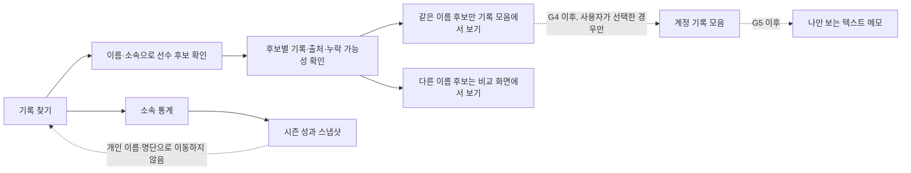

# AthleteTime: 기록 탐색, 소속 통계, 개인 공간 출시 계획

## 한 줄 목표

공개 기록은 `찾고·비교하고·출처를 확인하는` 경험으로 더 또렷하게 만들고, 개인 공간은 다른 사람의 기록이나 팀 통계와 섞이지 않는 계정 전용 기능으로만 단계적으로 연다.

## 계획 기준

- 기준 브랜치: `codex/record-ux-clarity`
- 현재 공개 기능: 이름·소속 기반 선수 후보 검색, 기록 모음, 비교, 소속 통계
- 현재 안전 원칙: 동명이인 자동 병합 금지, 공개 기록과 계정 자동 연결 금지, 소속 화면의 선수 명단화 금지
- 검토 관점: 중학생 선수, 학부모와 공용 기기 사용자, 대학·실업팀 주장, 코치·매니저, 기록 누락을 걱정하는 선수, 지원 담당자, 악의적 스크래퍼, 계정 탈취자, 미성년 보호 담당자, 저속 모바일 사용자

## 이미 확정된 사실

1. `기록 모음`은 사용자가 만든 보기 방식이지, 본인 선수 이력이나 공식 프로필이 아니다.
2. `athleteKey`와 `record.id`는 원본 정정 뒤에도 안전한 영구 참조가 아니므로 계정 저장에 쓰지 않는다.
3. 팀 통계는 공개 결과의 집계이지, 재적 명단·공식 메달·팀 순위가 아니다.
4. 기존 `/api/upload`는 공개 Cloudinary URL을 반환하므로 개인 사진에 절대 재사용하지 않는다.
5. 현재 채팅은 브라우저가 준 식별자·신고자 값을 신뢰하므로 작성 범위나 공개 범위를 넓히지 않는다.

## 현재 충돌과 정리

| 현재 상태 | 충돌 | 이 계획의 처리 |
| --- | --- | --- |
| 팀 API는 `scope`를 `latest`로 두고 정확한 `athleteCount`를 반환한다. | G2의 기간 정책과 G3의 소수 집단 보호가 아직 결정되지 않았다. | 현재 구현을 `G3 이전` 상태로 기록한다. 정확한 수치를 새 화면·새 API 필드·새 차트에 확대하지 않으며, G2·G3 승인 뒤에만 DTO 버전을 포함한 정정 작업을 한다. |
| 예전 채팅 오픈 문서는 공개 채팅·신고 큐·WebSocket 출시를 전제로 한다. | G6의 서버 인증·미성년 안전·운영 인력 조건과 충돌한다. | `docs/athletetime-chat-open-plan.md`는 G6 승인 전까지 대체된 계획으로 표시한다. 채팅은 기능 확대가 아닌 `확대 금지` 계약만 유지한다. |
| 브라우저 자동 검사는 로딩 문구와 실제 화면을 혼동할 수 있다. | 화면이 깨진 것과 검사가 너무 이른 것을 구분하지 못한다. | QA 준비 완료는 `정확한 URL + document ready + 로딩 문구 없음 + 실제 제목` 네 조건이 동시에 참일 때만 판정한다. |

## 목표 사용자 여정



## 범위와 금지선

### 이번 계획에 포함

- 공개 기록 화면의 선택 단위·출처·동명이인·빈 상태를 일관되게 다듬기
- 소속 통계를 팀의 시즌 성과판으로 유지하기 위한 데이터·문구·접근성 기준
- 계정 기반 기록 모음, 개인 텍스트 메모의 사전 계약과 출시 순서
- 사진·채팅에 대한 명시적 보류 기준과 운영 준비 요건
- 모바일, 로그인 전후, 공유 기기, 오류 복구, 지원 흐름의 수용 기준

### 이번 계획에서 제외

- 이름 자동 병합 또는 계정-선수 자동 연결
- 팀별 선수 목록, 개인 기록 우회 링크, 개인 공간 데이터의 집계·검색·추천
- 사진 업로드, 관리자 개인 메모 열람, 개인 메모 AI 분석·공유
- 채팅 공개 확대나 인증 전환
- 보유 데이터가 모든 경기나 완전한 선수 이력이라는 표현

## 고위험 소유자 결정 게이트

아래 항목은 코드 작업자가 추정으로 정하지 않는다. 승인 전에는 해당 단계의 구현을 시작하지 않는다.

| 게이트 | 소유자 결정 | 권장 기본값 | 차단되는 작업 |
| --- | --- | --- | --- |
| G2 | 팀 첫 화면 기간 | 최신 시즌, `이전 시즌`과 `전체`를 명시적 전환으로 제공 | 팀 기본 기간 변경 |
| G3 | 소수 집단 보호 | 고유 선수 5명 미만의 세부 교차 통계는 숨김 | 팀 세부 차트·수치 공개 |
| G4 | 안정 참조 체계 | `subject_uid`는 공개 기록 묶음, `record_uid`는 출처 행; 실제 인물 ID가 아님 | 계정 동기화 |
| G5 | 개인 메모 출시 정책 | 텍스트만, 최근 재인증, 30일 복구함, 소유자 외 동일 404 | 메모·사진 |
| G6 | 채팅 운영 체계 | 확대 동결, 별도 제한 베타 재심사 | 채팅 읽기·쓰기 확대 |

## 작업 순서

### 단계 0: 신뢰성 기준 고정

**성격:** 안전하고 되돌릴 수 있음. 즉시 진행 가능.

**소유 영역**
- `frontend/src/components/records/`
- `frontend/src/features/record-workspace/`
- `backend/tests/record-workspace-*.test.js`
- `backend/tests/records-flow-e2e.test.js`

**작업**
1. 모든 공개 선택 행동을 `이 선수 담기`, `선택한 선수`, `기록 모음`으로 통일한다. `내 기록`, `기록 담기`, 확인되지 않은 소유 표현은 후보 탐색 흐름에서 제거한다.
2. 기록 모음 상세에서 모든 행에 후보 이름·당시 소속을 고정해, 긴 목록에서도 어떤 후보의 기록인지 바로 보이게 한다.
3. 이름이 다른 후보는 저장 모음이 아니라 비교로 보내고, 같은 이름이라도 `같은 사람으로 합치지 않음`을 보이는 상태로 유지한다.
4. 검색 전·0건·잘못된 링크·느린 화면 전환 상태에 각각 한 가지 복구 행동만 제공한다.
5. 브라우저 QA는 주소 확인, Suspense 로딩 문구 제거, 실제 화면 제목 존재를 모두 확인한 뒤 통과로 판정한다. 로딩 화면을 최종 화면으로 오인하지 않는다.

**단계 0의 엄격한 범위**
- 바꿀 수 있는 것: 공개 기록·기록 모음·소속 통계의 문구, 빈 상태, 도움말, 접근성 이름, 현재 화면을 검증하는 테스트.
- 바꾸지 않는 것: 네비게이션 구조, 데이터 DTO, API 기본값, 팀 기간 정책, 팀의 정확한 수치, 계정 저장소, 로그인 권한.
- 신뢰성의 의미: `backend/tests/records-flow-e2e.test.js`를 연속 10회 실행했을 때, 준비 상태를 잘못 판정한 실패가 0회이고 실제 화면 오류는 별도로 실패로 보고한다. 성능 측정·API 타임아웃 변경은 이 단계에 포함하지 않는다.

**완료 조건**
- 검색, 후보 선택, 모음 검토, 비교, 뒤로가기에서 단위가 `선수 후보`로 일관된다.
- 다른 이름 후보가 단일 인물처럼 한 모음에 저장될 수 없다.
- 네트워크가 늦어도 로딩 문구가 사라진 뒤에만 E2E가 화면 준비로 판정한다.
- 390px 폭에서 가로 스크롤이나 잘린 행동 버튼이 없다.

### 단계 1: 소속 통계의 공개 성과판 고정

**성격:** API의 개인정보 경계를 먼저 테스트로 잠금. G2·G3의 표시 정책은 승인 후 적용.

**소유 영역**
- `card-studio/services/teamStatisticsService.js`
- `card-studio/services/teamDetailService.js`
- `card-studio/routes/recordAnalyticsRoutes.js`
- `frontend/src/features/team-performance/`
- `backend/tests/team-performance*.test.js`

**작업**
1. 공개 팀 DTO를 별도로 유지하고 재귀 검사로 `name`, `athleteKey`, `records`, `affiliations`, `workspace`, `note`, `attachment`이 어떤 깊이에도 없음을 강제한다.
2. 첫 화면은 팀명, 자료 기간, 마지막 자료 날짜, `출전이 확인된 대회`, `모은 기록에서 확인한 입상`, `최고 기록이 나온 횟수`, `종목 수`만 보이는 시즌 스냅샷으로 제한한다.
3. `입상`은 결승·종합 등 확정 가능한 1~3위만 계산하고, 예선·단계 미상·계주 중복·보류 원본은 수치에 포함하지 않는다. 제외한 수는 자료 범위에만 둔다.
4. 팀 흐름은 선수 최고기록이나 개인 이름 대신 시즌·종목·대회 단위의 분포로만 보인다.
5. 팀에서 개인으로 가는 유일한 행동은 이전 검색어·선택·개인 공간을 전달하지 않는 빈 `기록 찾기` 화면 이동이다.

**G3의 데이터 계약**
- 서버는 모든 통계를 계산한 뒤, 응답 직전에 공개용 DTO로 다시 감싼다. 브라우저가 숨김 여부를 결정하지 않는다.
- 억제 그룹은 `{ suppressed: true, message: "자료가 적어 세부 수치를 보여주지 않아요." }`만 갖고, 수치·차트 포인트·정렬 키·원시 선수 수를 포함하지 않는다.
- `athleteCount`는 G3 구현 시 `number | "under_threshold"`로 바꾸지 않는다. 공개 DTO에서는 `athleteCount: null`과 `isAthleteCountSuppressed: true`를 함께 사용해 숫자와 문구를 혼동하지 않는다.
- 팀 검색 요약, 팀 상세, 캐시 키, 정렬, 차트 데이터에 동일한 억제 규칙을 적용한다. 억제된 팀·그룹은 인원·입상·개선 수로 정렬하지 않는다.

**G2 승인 후 적용**
- API 기본값, URL, 선택된 컨트롤, 화면 카피가 하나의 기간 상수를 공유한다.
- 추천값은 최신 시즌이며, 이전 시즌과 전체는 사용자가 명시적으로 누른 경우에만 바뀐다.

**G3 승인 후 적용**
- 고유 선수 5명 미만의 `시즌 × 종목 × 부문` 그룹은 `suppressed: true`와 일반 메시지만 보내며 수치·차트 점·정렬 힌트를 모두 생략한다.
- 전체 팀의 고유 선수 수가 5명 미만이면 `5명 미만`만 표시한다.

**완료 조건**
- 팀 API에서 개인 식별자·개인 공간 키가 0건이다.
- 팀 검색에서 시즌 스냅샷 확인까지 모바일 3번 터치 이내다.
- 팀 상세에 선수 목록, 개인 기록 카드, 자동 개인 검색어가 없다.
- G3 승인 전에는 소수 집단 수치를 새로 노출하지 않는다.

### 단계 2: 안정 참조 설계와 계정 기록 모음

**성격:** G4 승인 전 설계와 테스트만, 승인 뒤 구현.

**작업**
1. 원천 파일, 대회, 행 위치, 정규화 버전을 바탕으로 `record_uid`를 설계한다. 원본의 생년월일·선수번호·제한 식별자를 사용하지 않는다.
2. `subject_uid`는 같은 공개 기록을 화면에서 묶기 위한 가명 그룹일 뿐, 실제 동일인·선수 소유권을 의미하지 않는다고 계약에 고정한다.
3. 원본 정정으로 행이 교체되면 기존 숨김·선택을 다른 행에 자동 이전하지 않고 `다시 확인 필요` 상태로 둔다.
4. 로그인한 사용자가 선택했을 때만 브라우저 모음을 계정으로 이관한다. 이관은 멱등 영수증, 30일 되돌리기, 실패 시 로컬 보존을 갖춘다.
5. 계정 A, 계정 B, 비회원, 관리자 요청이 같은 타인 모음 ID에 접근하면 모두 존재 여부를 알 수 없는 `404`를 받는다.

**완료 조건**
- 데이터 정정·동명이인·원천 행 교체 테스트에서 선택·숨김이 다른 공개 기록으로 이동하지 않는다.
- 공유 기기에서 계정 전환·재시도·오프라인 복귀가 교차 이관이나 중복을 만들지 않는다.
- `내 기록`은 이 단계에서도 사용하지 않는다.

**공용 기기 이관 규칙**
- 로그인 직후 자동 이관하지 않는다. `이 기기의 기록 모음 N개를 이 계정에 저장할까요?`라는 계정 확인 화면에서 한 번 더 선택해야 한다.
- 승인한 이관은 브라우저별 영수증 키와 계정 ID를 함께 기록한다. 같은 브라우저에서 다른 계정으로 로그인해도 기존 영수증을 재사용하거나 재이관하지 않는다.
- 성공 후에도 로컬 모음은 30일 동안 남기고, 되돌리기 전까지 어떤 로컬 데이터도 삭제하지 않는다.
- 실패·오프라인·한도 초과에서는 계정 데이터와 로컬 데이터를 모두 변경하지 않고 재시도만 제공한다.

**계정 보안 선행 조건**
- G4 구현 전에 비밀번호 재설정·변경 시 전체 기존 세션 폐기, 최근 재인증, 두 계정 격리 테스트가 먼저 통과해야 한다.
- 이 세 조건이 없으면 계정 모음 API·스키마·이관 버튼을 추가하지 않는다.

### 단계 3: 개인 텍스트 메모 제한 출시

**성격:** G5 승인 후에만 시작. 사진은 포함하지 않음.

**G5 전 원칙**
- 개인 메모는 문서·테스트 케이스·UX 시안까지만 다룬다. 보이지 않는 서버 스키마, 비어 있는 API, 숨겨진 프론트엔드 토글도 만들지 않는다.
- 메모 본문, 사진 URL, 객체 키, 채팅 본문, 신고자 ID, 계정-선수 연결은 로그, 오류 추적, 분석 이벤트, `.omo/evidence`에 저장하지 않는다.

**작업**
1. 메모 제목·본문·연결한 기록 모음은 계정 소유자만 읽고 쓰는 별도 저장소로 만든다.
2. 검색, 추천, 팀 통계, 공개 기록 API, 관리자 UI, 분석 이벤트, 오류 메시지, 일반 로그에 메모 제목·본문을 넣지 않는다.
3. 세션 복구 뒤 개인 공간 열기, 내보내기, 영구 삭제, 비밀번호 변경에는 최근 재인증을 요구한다.
4. 비밀번호 재설정 또는 변경은 다른 세션을 종료하고, 새로운 기기 복구 안내를 보낸다.
5. 삭제는 화면에서 즉시 숨기고 30일 복구함을 제공한다. 복구 기간이 끝난 삭제와 백업 만료의 차이는 사용자 문구에 사실대로 쓴다.

**완료 조건**
- 다른 계정·비회원·관리자가 메모 ID를 알아도 동일한 404만 받고 존재·내용을 알 수 없다.
- 로그·응답·분석 이벤트에서 메모 원문이 0건이다.
- 공용 기기와 만료 세션에서 개인 메모가 잠금 화면 뒤에 노출되지 않는다.
- 기록 추가 요청과 개인 메모 지원 흐름은 분리되어, 지원자가 계정과 공개 선수를 자동 연결하지 않는다.

### 단계 4: 사진과 채팅은 별도 재심사

**성격:** 구현 보류. G5/G6와 운영 역량 검토가 모두 필요.

**사진 재심사 조건**
- 공개 Cloudinary와 분리된 비공개 객체 저장소, 무작위 객체 키, 소유자 확인, 짧은 만료 URL이 준비된다.
- 브라우저가 JPEG·PNG·WebP만 허용하고 EXIF·GPS를 제거하며, 파일 크기·개수·계정 총량을 제한한다.
- 관리자 화면·로그·브라우저 저장소·공개 응답에 파일 URL, 원래 파일명, 객체 키가 없다.
- 스테이징 업로드 정리, 삭제·복구, 쿼터, 고아 파일, 비용·실패율 경보가 운영된다.

**채팅 재심사 조건**
- 이메일 인증 계정과 서버 발급 단기 채팅 티켓을 사용하고, 클라이언트 `userId`, 별칭, `reporterKey`를 신뢰하지 않는다.
- Origin, 메시지 길이, 발신 속도, 연결 수를 서버에서 제한한다.
- DB 저장에 실패하면 메시지 표시도 실패 처리하며 메모리 폴백으로 성공처럼 보이지 않는다.
- 미성년 보호, 신고 처리 담당자, 차단 지속성, 긴급 안전 안내, 보존 삭제 작업이 실제로 검증된다.

**실패 시 되돌리는 기본값**
- 개인 기능: UI를 숨기고 모든 비공개 자원 요청은 존재 여부를 드러내지 않는 `404`로 차단한다.
- 이관 기능: 서버 이관을 중단하고 브라우저 원본을 유지한다.
- 사진 기능: 새 업로드 URL 발급을 중지하고 이미 만료된 읽기 URL만 유지한다.
- 채팅: 새 쓰기를 거절하고, 기존 공개 기록 서비스와 개인 공간에는 영향을 주지 않는다.

## 테스트와 운영 증거

| 영역 | 자동 검증 | 실제 사용 확인 |
| --- | --- | --- |
| 기록 탐색 | 후보 단위·동명이인·비교·로딩 상태 계약 | 중학생·저속 모바일에서 이름 입력부터 기록 행 확인 |
| 소속 통계 | 공개 DTO 금지 필드·입상 계산·소수 집단 숨김 | 팀 검색부터 최신 시즌 스냅샷 확인 |
| 계정 모음 | 두 계정 격리·이관 멱등성·되돌리기 | 공유 기기 계정 전환과 오프라인 재시도 |
| 텍스트 메모 | 소유자 404·로그 비기록·재인증 | 로그인 만료, 삭제·복구, 비밀번호 재설정 |
| 사진 | EXIF 제거·URL 만료·타계정 차단 | 제한 베타 모바일 업로드와 비용 관측 |
| 채팅 | 서버 식별·신고 조작 방지·DB 실패 중단 | 담당자 신고 처리 시간과 미성년 안전 시나리오 |

## 작업자 분배

| 난이도 | 모델·역할 | 맡길 작업 |
| --- | --- | --- |
| 낮음 | Terra 중간 추론 | 문구 통일, 빈 상태, 모바일 레이아웃, 결정 문서 반영, 계약 테스트의 단순 추가 |
| 중간 | Terra 높음 | 공개 팀 DTO 정리, 기간 상태 단일화, E2E 준비 상태 안정화, 누락·오류 복구 화면 |
| 높음 | Sol 매우 높음 | G3 소수 집단 공개 기준, G4 안정 참조와 데이터 정정 전파, G5 계정 격리·재인증·삭제 계약, G6 채팅 재심사 |
| 소유자 | 제품·운영 책임자 | G2~G6 정책 선택, 미성년 보호 절차, 저장소·키 운영 책임, 채팅 운영 인력과 범위 |

## 위험과 대응

| 위험 | 예방·대응 |
| --- | --- |
| 동명이인을 한 사람처럼 보이게 함 | 후보별 행 라벨, 자동 병합 금지, 다른 이름은 비교로만 이동 |
| 팀 통계로 학생을 재식별 | 집계 전용 DTO, 소수 집단 서버 숨김, 명단·개인 카드 제거 |
| 공개 사진 URL 유출 | 개인 사진 출시 전까지 완전 보류, 공개 업로드 경로 재사용 금지 |
| 계정 탈취 후 개인 자료 열람 | 재인증, 비밀번호 변경·재설정 시 세션 폐기, 기기 복구 알림 |
| 지원자가 개인 내용을 보게 됨 | 지원 화면에는 상태·오류 코드·영수증만, 원문·첨부·URL 제거 |
| 채팅 신고 조작·괴롭힘 | 기능 확대 동결, 서버 발급 식별·제한·감사 체계 전까지 재출시 금지 |

## 작업 인수인계 형식

각 작업자는 푸시한 커밋에 아래만 남긴다.

```text
HANDOFF
commit: <40-character SHA>
branch: <branch>
scope: <changed paths>
verified: <test command and observable result>
decision: <G2-G6 decision or NONE>
open: <owner decision or NONE>
```

## 최종 검증 물결

1. 공개 화면은 공식 기록·완전한 이력·선수 소유권을 약속하지 않는다.
2. 팀 API와 화면은 개인 데이터, 선수 명단, 개인 공간을 노출하지 않는다.
3. 모든 개인 기능은 소유자 외 요청에 존재 여부를 알리지 않는다.
4. 미성년 사용자에게 사진·채팅 작성이 보호 절차 없이 열리지 않는다.
5. 공개 기록 정정·추가 요청은 계정과 선수의 자동 연결 없이 처리된다.
6. 모든 성공·실패 경로가 390px 모바일, 비회원, 회원, 공유 기기, 느린 네트워크에서 복구 가능하다.
