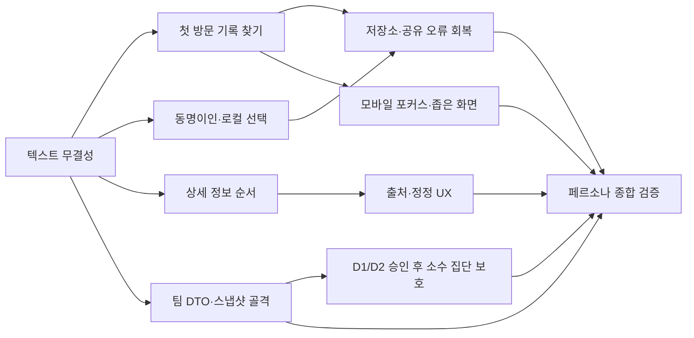

# 페르소나 기반 기록 탐색 UX 개선 계획

## 요약

AthleteTime의 핵심 가치는 공개 경기 결과를 `찾기 → 후보 확인 → 기록 이해 → 비교/정정`까지 짧고 안전하게 이어 주는 데 있다. 이번 계획은 학생 선수, 동명이인 선수, 팀 관계자, 공유 링크 방문자, 보호자, 코치, 운영자, 접근성 사용자를 포함한 25개 이상의 페르소나 검토 결과를 반영한다.

목표는 새 기능을 많이 늘리는 것이 아니다. 첫 화면과 상세 화면의 정보 순서를 정리하고, 동명이인과 데이터 범위를 더 분명하게 알리며, 실패·저장 문제에서도 사용자가 다음 행동을 알 수 있게 만드는 것이다.

## 확정 원칙

1. 같은 이름의 선수 기록은 자동으로 합치지 않는다. 이름, 소속, 확인 가능한 기간, 종목, 출처를 나란히 보여 주고 사용자가 직접 고른다.
2. `내 기록`은 본인 인증이나 소유 선언이 아니라 이 기기에서 만든 기록 모음이다. 이 문구는 진입·후보 선택·완료·재방문 화면에서 일관되게 유지한다.
3. 팀 화면은 선수 명단의 우회로가 아니라 공개 결과 범위의 팀 성과 요약이다. 개인 이름, 선수 키, 원본 행, 소속 이력, 개인 보관함, 메모, 첨부파일은 팀 API와 화면에 절대 포함하지 않는다.
4. 출처가 있는 공개 결과를 정리해 보여 주되, 공식 명단·공식 순위·완전한 경기 실적 증명처럼 보이게 하지 않는다.
5. 작은 화면에서 한 번에 한 가지 결정만 요구한다. 긴 설명과 여러 동작은 다음 화면이나 접힌 보조 영역으로 보낸다.
6. 새 개인 식별, 비공개 사진·메모, 미성년자 공개 정책, 자동 소속 병합은 이 계획의 구현 범위에서 제외한다.

## 발견된 핵심 문제

| 우선 | 문제 | 영향 받는 사람 | 개선 방향 |
| --- | --- | --- | --- |
| P0 | 일부 화면의 한글 문자열 인코딩 상태가 도구/환경에 따라 깨져 보이며, 현재 카피 테스트는 읽을 수 있는 문장을 보장하지 않는다. | 모든 사용자와 운영자 | UX 카피 변경 전에 바이트·렌더 기준의 텍스트 무결성 검증을 만든다. |
| P0 | 동명이인 후보를 고르는 근거가 여러 화면에 흩어져 있다. | 중·고등학생, 동명이인 선수, 보호자 | 이름·소속·기간·종목·출처를 한 확인 카드에 모으고 저장 전 다시 확인시킨다. |
| P0 | 로컬 저장소가 막히면 휘발성 모드로 안전하게 전환되지만 사용자는 저장되지 않을 수 있음을 알지 못한다. | 재방문 사용자, 저사양/공용 기기 사용자 | 화면에 저장 상태와 복구 방법을 보여 준다. |
| P1 | 첫 기록 화면의 `나 찾기`, 둘러보기, 팀, 시즌, 비교, 공유 선택지가 한 번에 많다. | 첫 방문 학생, 모바일 사용자 | 첫 화면을 `기록 찾기` 중심으로 줄이고 나머지는 목적별 다음 화면으로 이동시킨다. |
| P1 | 선수 상세에서 최고·최근·시즌 기록과 출처/누락 가능성이 함께 밀집되어 빠르게 판단하기 어렵다. | 선수, 코치, 공유 링크 방문자 | 요약과 데이터 범위를 상단에 고정하고, 긴 기록은 종목·시즌 선택 뒤에 표시한다. |
| P1 | 팀 통계가 향후 개인 재식별 또는 공식 팀 성과로 오해될 수 있다. | 학교·실업팀 관계자, 보호자 | 팀 전용 공개 DTO, 통계 정의, 소수 집단 보호 기준을 먼저 고정한다. |
| P1 | 정정 요청이 삭제 중심으로 보이고 자유 입력에서 민감정보를 과도하게 적을 수 있다. | 선수, 보호자, 관리자 | 정정 목적과 최소 정보 원칙을 우선 노출하고 처리 상태를 쉬운 말로 보여 준다. |
| P2 | 오래된 공유 링크, 대회 결과 오류, 느린 네트워크에서 다음 탐색 행동이 일관되지 않다. | 공유 링크 방문자, 일반 사용자 | 각 실패 화면에 `다시 찾기` 또는 `대회 둘러보기` 하나를 둔다. |
| P2 | 모바일 메뉴는 키보드 포커스가 배경으로 빠질 가능성이 있고, 375px에서 긴 동작 카드가 답답할 수 있다. | 키보드 사용자, 작은 화면 사용자 | Drawer 포커스 격리와 좁은 화면 시나리오를 E2E로 잠근다. |

## 범위와 금지선

### 이번 구현에 포함

- 읽을 수 있는 한글 카피와 렌더링의 무결성 확인 및, 확인된 화면에 한정한 안전한 수정
- 기록 허브, 후보 선택, 선수 상세, 기기 로컬 기록 모음의 흐름·카피·오류 복구
- 데이터 요청의 최소 정보 안내와 안전한 상태 문구
- 팀 화면의 집계 전용 경계, 통계 정의, 테스트용 DTO 정비
- 공유 링크·대회 결과 실패 시 다음 행동 제공
- 모바일 375px/390px, 키보드, 느린 네트워크, 손상된 저장소 테스트

### 이번 구현에서 절대 하지 않음

- 동명이인 또는 소속 변경의 자동 병합·본인 추정·소유/인증 주장
- 팀 화면에서 개인 목록·개인 기록·선수 키·원본 결과 행·개인 보관함 정보 노출
- 비공개 메모·사진을 기존 `/api/upload/*` 또는 공개 Cloudinary 경로에 저장
- 미성년자 공개 범위, 공유 허용 범위, 소수 집단 기준을 승인 없이 변경
- 익명 채팅을 인증 회원 채팅으로 바꾸기
- 새 데이터 수집, 원본 파일 적재, 실적 증명 또는 공식 순위 기능 추가

## 결정이 필요한 항목

아래 항목은 구현 전에 소유자의 명시적 결정을 받아야 한다. 결정 전에는 계약 테스트와 화면 골격까지만 만들며, 실제 공개 정책은 바꾸지 않는다.

| 결정 | 선택지와 영향 | 기본 보류 상태 |
| --- | --- | --- |
| D1. 팀 소수 집단 보호 | 고유 선수 5명 미만일 때 전체 팀 숫자도 `5명 미만`으로 숨길지, 세부 교차 집계만 숨길지 | API 변경과 공개 수치 변경을 보류한다. |
| D2. 팀 `athleteCount` | 공개 집계에 선수 수를 포함할지, 대회·입상·개선·종목 4개 지표만 둘지 | v1 화면에서는 선수 수를 주 지표에서 제외한다. |
| D3. 정정 요청 기본 유형 | `정정` 기본 선택, 아무것도 선택하지 않음, 현재 `삭제` 유지 | 삭제 기본값을 새로운 UX에서 확대하지 않는다. 최종 기본값 변경은 승인 후 한다. |
| D4. 비공개 메모·사진 | 계정/보관함/선수 기록 중 어디에 귀속하고, 보존·삭제·공유를 어떻게 할지 | 별도 private storage, 서명 URL, 계정 권한, 삭제·보존 정책이 확정될 때까지 구현 금지. |
| D5. 미성년자 보호와 공유 | 기본 숨김, 보호자/본인 요청, 공유 카드 제한의 범위 | 현행 정정 우선 안내만 유지하고 새로운 공개·공유 동작은 추가하지 않는다. |
| D6. 인증된 프로필·채팅 | 익명 세션을 회원 기반 관계로 옮길지 | 별도 마이그레이션 계획과 데이터 계약 없이는 착수하지 않는다. |

## 실행 순서

## TODOs

### Wave 0: 근거와 텍스트 무결성

- [x] Task 0.1: 화면 텍스트 무결성 기준 만들기

**목적**: 한국어 카피가 저장소 바이트, 개발 서버 렌더, 테스트 출력에서 모두 읽히는지 확인한 뒤에만 UX 카피를 수정한다.

**대상**
- `frontend/src/pages/RecordsPage.tsx`
- `frontend/src/pages/DataRequestPage.tsx`
- `frontend/src/features/team-performance/TeamPerformancePage.tsx`
- `frontend/src/config/dataPolicy.ts`
- 각 화면의 기존 카피 테스트

**구현 지침**
- 파일 바이트를 UTF-8로 읽어 대표 문구가 손상 없이 존재하는지 확인하는 작은 회귀 테스트를 추가한다.
- 실제 브라우저 또는 기존 E2E 하니스에서 대표 제목과 안내 문구를 찾는다. 콘솔 또는 셸 인코딩만 깨진 경우와 소스 자체가 깨진 경우를 분리한다.
- 소스가 실제로 손상된 파일만 UTF-8로 제한적으로 복원한다. 전체 저장소 일괄 변환은 금지한다.

**완료 조건**
- 대표 4개 화면에서 소스와 렌더 텍스트가 동일한 읽을 수 있는 한국어 문장으로 검증된다.
- UTF-8 아닌 소스가 발견되면 해당 파일·원인·수정 범위를 evidence에 기록한다.
- 기능 동작·URL·API 응답은 바뀌지 않는다.

**검증**
- Node 텍스트 무결성 테스트
- 각 화면의 기존 Vitest/Node 테스트
- 375px과 데스크톱 화면에서 제목·주요 CTA 렌더 확인

**커밋**: `test(ux): lock readable korean copy on trust surfaces`

### Wave 1: 기록을 찾고 고르는 핵심 흐름

- [x] Task 1.1: 첫 방문 기록 허브를 목적 중심으로 단순화

**목적**: `/records` 첫 화면에서 학생이 3초 안에 `기록 찾기`를 시작하고, 비교·팀·시즌은 필요한 다음 단계에서 발견하게 한다.

**대상**
- `frontend/src/components/records/RecordsHub.tsx`
- `frontend/src/components/records/RecordsBrowseGateway.tsx`
- `frontend/src/pages/RecordsPage.tsx`
- 관련 컴포넌트 및 E2E 테스트

**구현 지침**
- 첫 화면 주 동작은 `이름 또는 소속으로 기록 찾기` 하나로 둔다.
- 보조 동작은 `내가 고른 기록 모아보기`와 `팀 성과 보기` 두 개까지만 노출한다.
- 직접 입력 흐름에는 예시 선수·가짜 데이터·추천 이름을 넣지 않는다.
- 기존 route/query 호환성은 유지하고, 선택지가 줄어들어도 뒤로가기와 새로고침은 현재 상태를 안전하게 복원한다.

**완료 조건**
- 첫 방문자가 `/records`에서 한 번의 입력 후 후보 목록에 도달한다.
- 첫 화면에 소유·본인 인증·공식 완전성 주장 문구가 없다.
- 375px에서 가로 스크롤, CTA 가림, 키보드로 인한 고정 버튼 가림이 없다.

**검증**
- Hub/브라우즈 컴포넌트 테스트
- Playwright 또는 기존 실제 브라우저 하니스: `/records` → 입력 → 후보 카드
- 375x667 및 390x844 스크린샷·콘솔 오류 0건

**커밋**: `feat(records): simplify first-use record discovery`

- [x] Task 1.2: 동명이인 확인과 기기 로컬 선택의 경계 강화

**목적**: 다른 선수 기록과 내 선택이 섞였다는 느낌을 없애고, 저장 전에 한 번 더 근거를 확인시킨다.

**대상**
- `frontend/src/components/records/RecordsMineCandidateStep.tsx`
- `frontend/src/components/records/RecordsMineConfirmStep.tsx`
- `frontend/src/components/records/RecordsMineDoneStep.tsx`
- `frontend/src/features/record-workspace/components/RecordCandidateCard.tsx`
- `frontend/src/features/record-workspace/components/RecordIdentityHeader.tsx`
- 후보/보관함 회귀 테스트

**구현 지침**
- 동명이인 후보에는 이름, 당시 소속, 확인 가능한 연도 범위, 종목 수, 출처 범위를 같은 시야에 표시한다.
- 선택 직전 화면에서는 `이 기기에 저장하는 선택이며 본인 인증이 아니다`를 짧게 반복한다.
- 같은 이름 경고는 hover나 접힘 영역에 숨기지 않는다.
- 비교와 기기 로컬 모음은 후보를 합치지 않고 각 후보를 별도 항목으로 유지한다.

**완료 조건**
- 동일 이름·다른 소속 fixture에서 카드가 항상 분리되고, 자동 병합 경로가 없다.
- 저장/공유 전 화면에 동명이인 확인과 로컬 선택 문구가 함께 있다.
- 새로고침·뒤로가기 후에도 잘못된 후보가 자동 선택되지 않는다.

**검증**
- candidate list, mine confirm/done, workspace page 테스트
- API preview 테스트에서 선수 키/기록 경계 유지
- 모바일 키보드·탭 순서 E2E

**커밋**: `feat(records): make candidate identity context explicit`

- [x] Task 1.3: 선수 상세의 정보 순서와 비교 진입 정리

**목적**: 기록이 많아도 상단에서 `누구의 어떤 공개 기록을 보고 있는지`, `어디까지 모였는지`, `다음에 무엇을 할지`를 알게 한다.

**대상**
- `frontend/src/pages/AthleteDetailPage.tsx`
- `frontend/src/features/record-workspace/pages/RecordAthletePage.tsx`
- `frontend/src/features/record-workspace/pages/RecordAthleteRecordTab.tsx`
- record insight 컴포넌트와 테스트

**구현 지침**
- 상단은 선수 후보 문맥(소속·확인 기간), 자료 범위(출처·마지막 확인일·누락 가능성), 1차 동작(기록 보기/비교/정정 요청) 순서로 정리한다.
- 최고·최근·시즌 기록은 선택한 종목/기간에 대한 값이라는 범위를 함께 보여 준다.
- 긴 타임라인과 부가 인사이트는 접혀 시작하거나 종목·시즌을 고른 후 보인다.
- 개인으로 보이는 기록과 비교 대상은 각각 새 화면 또는 명확한 탭으로 열고, 팀 맥락·기기 보관함 선택을 자동 전파하지 않는다.

**완료 조건**
- 375px에서 초기 화면에 후보 문맥, 자료 범위, 주 동작이 모두 보인다.
- 출처 없는 완전성·공식성 문구가 없다.
- 비교 화면으로 이동해도 후보별 기록은 합쳐지지 않는다.

**검증**
- 선수 상세 loading/not-found/network error 테스트
- 동일 이름 fixture와 부분 데이터 fixture
- 375px visual E2E와 공유 URL 회귀 테스트

**커밋**: `feat(records): clarify athlete detail context and actions`

### Wave 2: 재방문·오류·신뢰 회복

- [x] Task 2.1: 기기 저장소 상태를 숨기지 않기

**목적**: 저장이 불가능하거나 임시 저장으로 전환된 경우 사용자가 기록 모음이 사라질 수 있음을 바로 알게 한다.

**대상**
- `frontend/src/features/record-workspace/storageBoundary.ts`
- `frontend/src/features/record-workspace/useRecordWorkspaceStore.ts`
- `RecordWorkspacePage.tsx`, `RecordWorkspaceManagerPage.tsx` 및 관련 UI

**구현 지침**
- `volatile`, `corrupt`, `oversized`, `blocked` 상태에 짧은 상태 배너와 복구 행동을 연결한다.
- 세션 초안, 이 기기에 저장된 모음, 휘발성 임시 상태를 서로 다른 말로 설명한다.
- 사용자 기록을 자동으로 지우거나 서버에 업로드하지 않는다.

**완료 조건**
- 저장소 접근 거부·손상·용량 초과 fixture에서 화면은 열리고, 상태와 복구 경로가 보인다.
- 정상 상태에서는 경고가 보이지 않는다.

**검증**
- storage boundary/unit 테스트
- 손상된 localStorage/sessionStorage pre-load E2E
- 새로고침 후 모드별 표시 테스트

**커밋**: `feat(workspace): surface local storage recovery state`

- [ ] Task 2.2: 공유·대회·네트워크 실패의 다음 행동 통일

**목적**: 깨진 링크 또는 부분 실패가 빈 화면·막다른 길이 되지 않게 한다.

**대상**
- `frontend/src/pages/RecordsPage.tsx`
- `frontend/src/pages/AthleteDetailPage.tsx`
- `frontend/src/pages/MatchResultListPage.tsx`
- `frontend/src/pages/MatchResultDetailPage.tsx`
- 필요 시 `NotFoundPage.tsx`

**구현 지침**
- 오류 종류(존재하지 않음, 숨김 처리됨, 네트워크 실패)를 backend가 구별할 수 있을 때만 다르게 설명한다. 구별하지 못하면 추측하지 않는다.
- 모든 실패 화면에는 현재 맥락에 맞는 하나의 다음 행동을 둔다: `기록 다시 찾기`, `대회 둘러보기`, `다시 시도` 중 하나.
- 이전 검색어는 사용자가 입력한 경우에만 보존하며, 실패가 난 후보나 팀을 자동 재선택하지 않는다.

**완료 조건**
- 잘못된 선수/대회 URL, 빈 결과, 네트워크 실패에서 CTA가 하나 이상 있고 route가 유효하다.
- stale/malformed query로 인해 로컬 보관함이나 후보 선택이 복원되지 않는다.

**검증**
- URL parsing unit 테스트
- error/empty 상태 컴포넌트 테스트
- 실제 브라우저에서 4개 실패 경로 회귀 E2E

**커밋**: `feat(navigation): add recovery actions to record failures`

- [ ] Task 2.3: 출처·정정 요청의 최소 정보 UX

**목적**: 기록의 출처와 한계를 먼저 알리고, 정정 요청은 삭제보다 안전한 교정 흐름으로 이해되게 한다.

**대상**
- `frontend/src/config/dataPolicy.ts`
- `frontend/src/pages/AthleteDetailPage.tsx`
- `frontend/src/pages/DataRequestPage.tsx`
- `frontend/src/api/dataRequests.ts`
- data-rights 카피·계약 테스트

**구현 지침**
- 상세 화면의 출처 라벨은 검증 배지가 아니라 `모은 공개 결과의 출처`라는 뜻으로 통일한다.
- 요청 입력 전 주민등록번호, 사진, 진단·연락처 등 불필요한 민감정보를 적지 말라는 안내를 표시한다.
- 이름과 요청 사유만 필수로 유지하고 소속·종목·대회·연락처는 선택값인지 분명하게 표시한다.
- D3가 승인되기 전에는 요청 유형의 기본값을 바꾸지 않는다. 다만 `삭제`가 기본 선택인 현재 UI에서 삭제를 권하는 문구나 강조를 추가하지 않는다.
- 공개 상태 문구는 `접수됨`, `확인 중`, `반영됨`, `처리 완료`처럼 사용자 말로 매핑하되, 관리자 내부 상태값·연락처·검토 메모를 노출하지 않는다.

**완료 조건**
- 요청 화면에 최소 정보 안내와 선택/필수 항목 구분이 있다.
- 선수 상세·대회 화면에 공식성 오해를 막는 짧은 자료 범위 안내가 있다.
- admin 상태 전이와 optimistic versioning은 바뀌지 않는다.

**검증**
- data request form/receipt/status 테스트
- 민감정보 금지 안내 및 `official`/`ranking`/`verified` 오해 문구 정적 검사
- request lifecycle API 테스트

**커밋**: `feat(data-rights): clarify public sources and minimal requests`

### Wave 3: 팀 성과판과 모바일 접근성

- [ ] Task 3.1: 팀 성과판의 공개 DTO와 화면 골격 정비

**목적**: 팀 검색 결과를 선수 카드 목록처럼 보이지 않게 하고, `최신 시즌`의 팀 성과를 간단한 집계로 보여 줄 준비를 한다.

**대상**
- `card-studio/services/teamStatisticsService.js`
- `card-studio/services/teamPerformanceService.js`
- `frontend/src/features/team-performance/teamPerformanceContracts.ts`
- `frontend/src/features/team-performance/TeamPerformancePage.tsx`
- team API/contract/UI 테스트

**구현 지침**
- 기본 화면은 팀명, 자료 기준 기간, 마지막 자료 날짜와 다음 4개만 우선 보여 준다: 색인된 대회 참가 수, 1~3위가 확정된 입상 기록 수, 비교 가능한 기록 개선 수, 종목 수.
- 정의를 도움말에 고정한다. 계주, 상태만 있는 결과, 원본이 보류된 결과는 지표에서 제외하거나 `확인 중`으로 별도 표현한다.
- 흐름은 개인이 아닌 분포로만 표현한다: 종목별 참여 비중, 월/대회별 결과 수, 시즌별 4개 지표 변화. 개인 최고 기록·가장 크게 향상한 선수·팀 선수 목록은 v1에 넣지 않는다.
- public API는 팀 라우팅에 필요한 `teamKey`, 대회 이동에 필요한 `competitionKey`만 허용한다. 선수 키, 선수 이름, 원본 record, 소속 이력, workspace, note, attachment, source ID는 재귀적으로 금지한다.
- D1/D2가 결정되기 전에는 소수 집단의 수치 공개 범위를 바꾸지 않는다. 이 기간에는 DTO 정리, 테스트 fixture, 화면 도움말만 진행한다.

**완료 조건**
- team detail은 개인 목록·원본 행·개인 보관함을 반환하거나 렌더하지 않는다.
- 최신 시즌 전환이 기본이고, 이전 시즌/전체는 명확한 선택으로 분리된다.
- 4개 팀 지표의 계산 fixture가 정의와 100% 일치한다.
- D1/D2 승인 전에는 새 소수 집단 숫자나 선수 수 지표를 화면 전면에 추가하지 않는다.

**검증**
- team service unit/contract/API 테스트
- DTO 재귀 검사에서 `name`, `athleteKey`, `records`, `affiliations`, `workspace`, `note`, `attachment` 0개
- 375px 팀 검색→스냅샷 3탭 이내 E2E

**커밋**: `refactor(team): prepare aggregate-only season snapshot`

- [ ] Task 3.2: D1/D2 승인 후 팀 소수 집단 보호 적용

**시작 조건**: D1, D2의 명시적 승인.

**구현 지침**
- 승인된 기준이 고유 선수 수 기준인지, 결과 수 기준인지, 전체/교차 집계에 모두 적용되는지 contract version과 화면 카피에 명시한다.
- 기준 미만에는 숫자·차트 포인트·정렬 힌트 모두 숨기거나 승인된 redacted 상태로 통일한다.
- 캐시 키와 Cache-Control 정책을 갱신하고 이전 DTO가 남아 있지 않음을 확인한다.

**완료 조건**
- 4인/5인 경계 fixture에서 승인된 기준대로 API·차트·텍스트가 함께 바뀐다.
- 이전 캐시나 deep link로 소수 그룹 세부 수치가 노출되지 않는다.

**검증**
- server contract 4/5 fixture 테스트
- 캐시·API response test
- small-group mobile/desktop visual E2E

**커밋**: `feat(team): apply approved small-group protection`

- [ ] Task 3.3: 모바일 메뉴와 좁은 화면의 상호작용 잠금

**목적**: 화면 크기나 입력 수단에 따라 메뉴·CTA가 깨지지 않게 한다.

**대상**
- `frontend/src/components/layout/HeaderMobileDrawer.tsx`
- `frontend/src/components/layout/MobileTabBar.tsx`
- `frontend/src/components/layout/Header.tsx`
- 좁은 화면의 record/team/data request 컴포넌트

**구현 지침**
- 기존 `Sheet`가 접근성 요구를 충족하면 우선 재사용하고, 그렇지 않으면 메뉴 열기 시 초기 포커스, Tab 순환, Escape 닫기, 메뉴 버튼으로 포커스 반환, 배경 비활성화를 구현한다.
- 375x667과 390x844에서 긴 팀명·동작 라벨이 잘리지 않게 하고, 한 번에 두 개 이상의 고정 CTA가 겹치지 않게 한다.

**완료 조건**
- 열린 drawer에서 Tab이 배경 링크로 이동하지 않고 Escape 후 메뉴 버튼으로 돌아온다.
- 핵심 화면에 가로 스크롤과 잘린 버튼 텍스트가 없다.

**검증**
- keyboard drawer E2E
- 375x667/390x844 screenshot regression
- console/page errors 0건

**커밋**: `fix(mobile): keep navigation focus and actions contained`

### Wave 4: 종합 검증과 배포 판단

- [ ] Task 4.1: 페르소나 회귀 매트릭스와 출시 판정

**목적**: 각 개선이 실제 사용자 흐름을 해치지 않았음을 기능·개인정보·모바일 관점에서 한 번에 검증한다.

**필수 시나리오**

| 페르소나 | 시나리오 | 합격 조건 |
| --- | --- | --- |
| 중학생 첫 방문자 | `/records` → 이름 입력 → 후보 선택 | 1회 입력 후 후보 도달, 동명이인 경고·로컬 선택 문구 확인 |
| 동명이인 선수 | 동일 이름·다른 소속 카드 확인 후 기록 모음 | 두 후보가 병합되지 않고, 저장 전 근거가 함께 표시됨 |
| 재방문 사용자 | 정상/차단/손상 저장소로 보관함 열기 | 손실 가능 상태가 보이고 앱이 멈추지 않음 |
| 팀 주장 | 팀 검색 → 최신 시즌 스냅샷 → 시즌 전환 | 집계만 보이고 개인 목록/원본 행 없음 |
| 보호자 | 선수 상세 → 출처 확인 → 정정 요청 | 공식성 오해 문구 없음, 민감정보 최소 안내 있음 |
| 공유 링크 방문자 | 존재하지 않는 선수/대회 링크 | 빈 화면 없이 다시 찾기 또는 둘러보기 제공 |
| 키보드/모바일 사용자 | 375px drawer와 후보 선택 | 포커스 격리, 가로 스크롤 없음, 버튼 조작 가능 |

**최종 게이트**
- TypeScript type-check, build, 변경 파일 lint, 관련 Node/Vitest 테스트, 실제 브라우저 E2E가 모두 통과한다.
- 전체 lint가 실패하면 신규 오류와 기존 baseline 오류를 분리해 기록한다.
- public team DTO 재귀 검사와 no-auto-merge 계약이 통과한다.
- private notes/photos, D1-D6 보류 기능이 이번 변경에 유입되지 않았음을 정적 검사한다.
- evidence를 `.omo/evidence/persona-led-records-ux/`에 저장한다.

**커밋**: `test(ux): verify persona-led record journeys`

## 의존성 순서

## 실행 전 체크리스트

- 현재 브랜치와 PR #79의 변경 사항을 먼저 동기화하고, 사용자가 수정한 파일은 되돌리거나 포맷하지 않는다.
- 각 task는 테스트를 먼저 보강하거나 기존 테스트의 빈틈을 재현한 뒤에 최소 변경만 한다.
- 팀 API 응답과 공개 화면은 별도 reviewer가 재귀 스캔한다.
- private notes/photos 관련 요청이 생기면 이 계획을 중단하지 말고 D4 결정을 위한 별도 보안 설계 문서로 분리한다.
- D1-D6 외의 가벼운 카피·레이아웃·오류 복구 작업은 본 계획 순서에 따라 자율적으로 진행할 수 있다.
